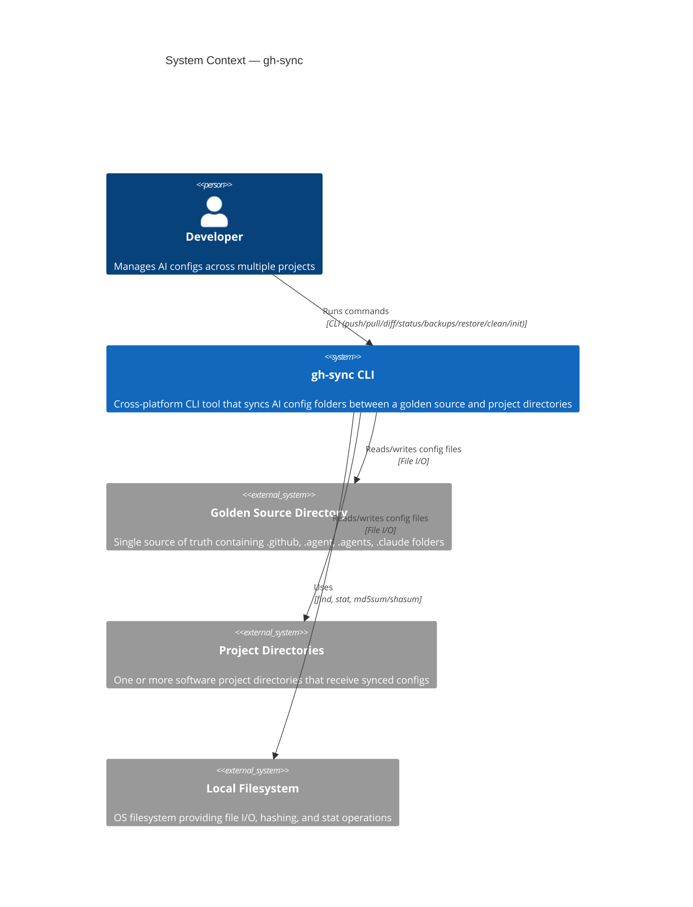
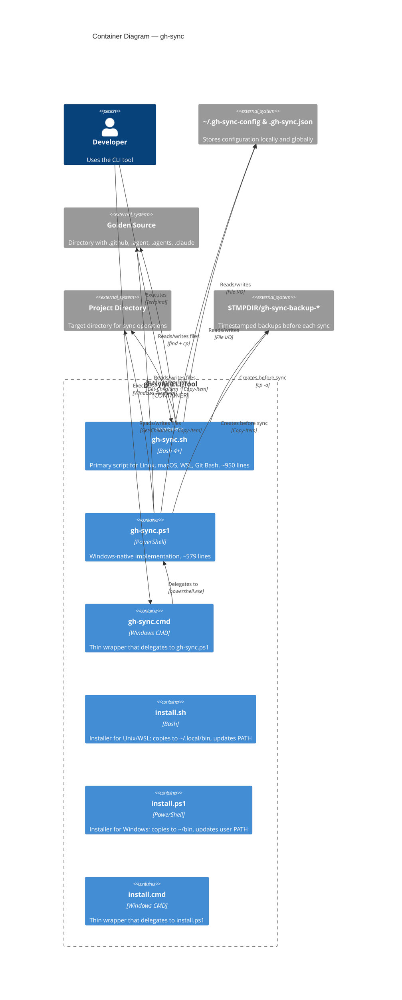
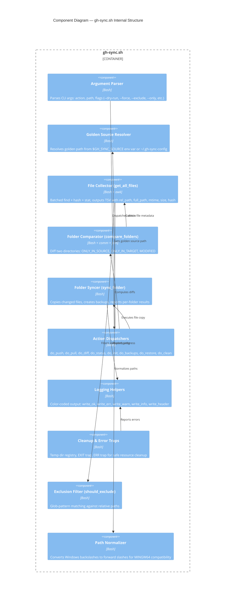
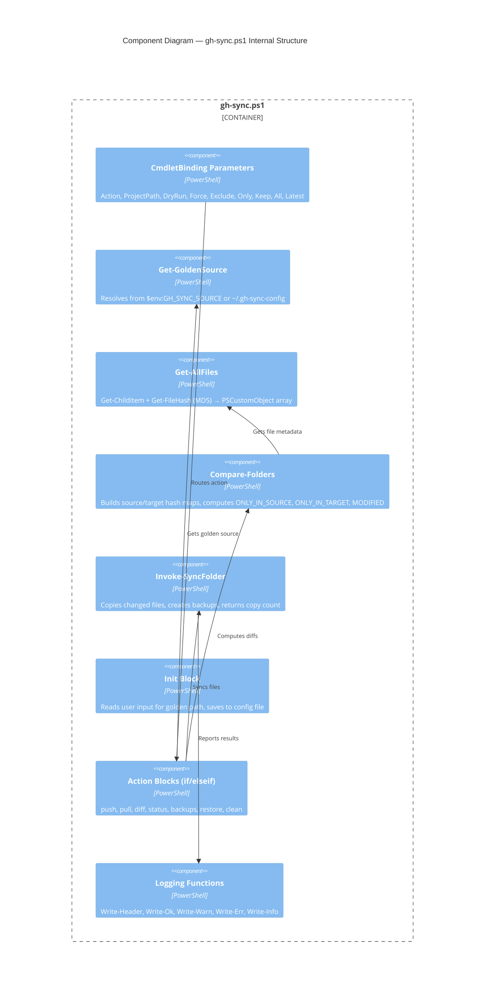
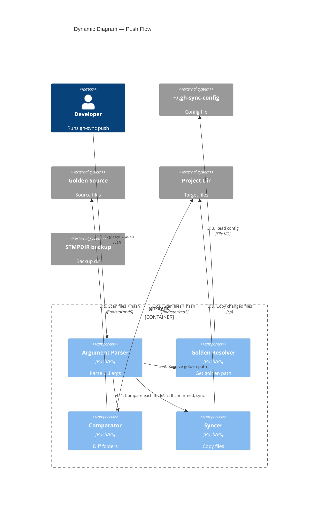
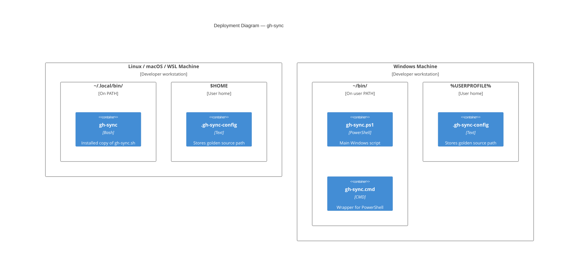

# 02 — Architecture

This document describes the software architecture of gh-sync using **C4 model** diagrams (Mermaid syntax).

---

## Level 1 — System Context

This diagram shows gh-sync in the context of the people and external systems it interacts with.



---

## Level 2 — Container Diagram

gh-sync is a **standalone** CLI application with two parallel implementations. There is no server, no database, and no network communication.



---

## Level 3 — Component Diagram (Bash Implementation)

This breaks down the internal structure of `gh-sync.sh` — the most complex artifact in the project.



---

## Level 3 — Component Diagram (PowerShell Implementation)



---

## Dynamic Diagram — Push Flow

This shows the step-by-step sequence when a user runs `gh-sync push`.



---

## Deployment Diagram

gh-sync is a purely local tool — no servers, no cloud, no containers.



---

## Data Flow Summary

```
1. User runs: gh-sync <action> [path] [flags]

2. Argument parsing
   → Validate action (push|pull|diff|status|init|backups|restore|clean)
   → Extract --dry-run, --force, --exclude, --only, --keep, --all, --latest

3. Configuration & Golden source resolution
   → Check $GH_SYNC_SOURCE env var
   → Check local .gh-sync.json in project
   → Fallback: read ~/.gh-sync-config

4. For each sync folder (.github, .agent, .agents, .claude):
   a. Collect all files in source dir
      → find + batch md5sum/shasum + batch stat
      → Merge into TSV: rel_path | full_path | mtime | size | hash
      → Apply exclusion filters
   b. Collect all files in target dir (same process)
   c. Compare using sorted key diff:
      → comm -23: files only in source
      → comm -13: files only in target
      → join + hash compare: modified files

5. Display results (diff/status) or execute sync (push/pull):
   a. If --dry-run → show what would change, exit
   b. If not --force → prompt "Proceed? [y/N]"
   c. Create timestamped backup of target folder
   d. Copy changed files (ONLY_IN_SOURCE + MODIFIED)
   e. Report per-folder and grand-total stats
```
