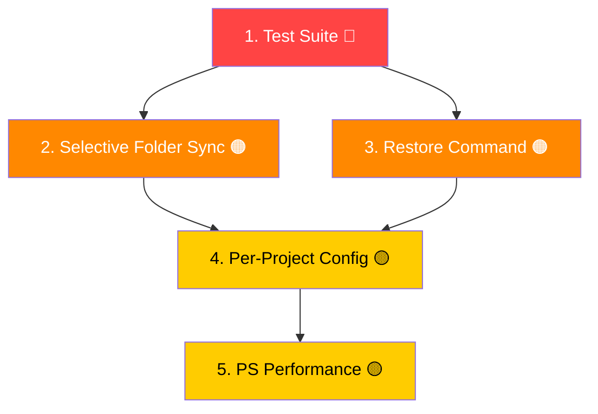

# 11 — Improvement Plan

> **Created:** 2026-03-03
> **Updated:** 2026-03-18
> **Status:** Active
> **Total Items:** 5 priorities, 25 sub-tasks

---

## Priority Summary

| # | Improvement | Priority | Impact | Effort |
|---|------------|----------|--------|--------|
| 1 | [Automated Test Suite](#1-automated-test-suite) | 🔴 **Critical** | High | Medium |
| 2 | [Selective Folder Sync](#2-selective-folder-sync) | 🟠 **High** | High | Low |
| 3 | [Restore Command & Backup Management](#3-restore-command--backup-management) | 🟠 **High** | High | Low |
| 4 | [Per-Project Configuration File](#4-per-project-configuration-file) | 🟡 **Medium** | Medium | Medium |
| 5 | [PowerShell Performance Optimization](#5-powershell-performance-optimization) | 🟡 **Medium** | Medium | Medium |

---

## 1. Automated Test Suite

> **Priority:** 🔴 Critical  
> **Impact:** High — prevents regressions, enables confident refactoring  
> **Effort:** Medium  
> **Reason:** gh-sync manipulates files on disk with copy/overwrite operations. A single bug can silently corrupt or lose config files across all projects. Currently, there are **zero automated tests** — all testing is manual. This is the single biggest risk.

### Current State

- No test framework or test files exist
- Testing is entirely manual (listed in `10-DEVELOPER-GUIDE.md`)
- No CI/CD pipeline

### Sub-Tasks

- [x] **1.1 — Set up test framework (Bash)**
  - Framework: [BATS (Bash Automated Testing System)](https://github.com/bats-core/bats-core)
  - Created `tests/` directory with 4 test files
  - Created `tests/test_helper.bash` with fixtures and helpers
  - Teardown helpers clean temp directories
  - Created `run-tests.sh` runner script

- [ ] **1.2 — Set up test framework (PowerShell)**
  - Use [Pester](https://pester.dev/) (standard PowerShell testing framework)
  - Create `tests/gh-sync.Tests.ps1`
  - Create test fixtures (temp golden + project dirs)
  - Add `Invoke-Pester` as entry point

- [x] **1.3 — Write core logic tests**
  - `tests/01-push-pull.bats` — push (new files, modified, preserved, dry-run, --only, --exclude) and pull
  - `tests/02-diff-status.bats` — diff symbols [+]/[-]/[~] and status counts
  - `tests/04-backup-restore.bats` — backup creation, restore --latest, clean --all

- [x] **1.4 — Write edge case tests**
  - `tests/03-edge-cases.bats` — spaces/unicode/parentheses in filenames, binary files, deeply nested dirs
  - Empty directory handling, idempotency, missing golden source, unknown actions
  - `--dry-run` must NOT modify files (asserted via file counts)
  - `--exclude` patterns respected, `.gh-sync.json` config file, CLI override precedence

- [x] **1.5 — Set up CI/CD pipeline**
  - Created `.github/workflows/test.yml`
  - Bash tests on `ubuntu-latest` and `macos-latest`
  - PowerShell skeleton on `windows-latest` (Pester)
  - ShellCheck linting on all `.sh` files
  - Triggers on push and pull requests
  - Badge added to README

---

## 2. Selective Folder Sync

> **Priority:** 🟠 High  
> **Impact:** High — most requested developer workflow improvement  
> **Effort:** Low  
> **Reason:** Currently, `gh-sync push` syncs ALL four folders (`.github`, `.agent`, `.agents`, `.claude`). There is no way to sync only one. In practice, a developer often wants to push just `.github/` after editing a Copilot agent, without touching the other three folders. This is the most obvious missing feature.

### Current State

```bash
# This syncs ALL four folders — no way to pick just one
gh-sync push
```

### Proposed Solution

Add a `--folder` / `--only` flag:

```bash
# Sync only .github
gh-sync push --only .github

# Sync two specific folders
gh-sync push --only .github,.agents

# Current behavior (all folders) remains the default
gh-sync push
```

### Sub-Tasks

- [x] **2.1 — Add `--only` flag to Bash argument parser**
  - Add `--only` to `parse_args()` with comma-separated parsing (same pattern as `--exclude`)
  - Store in `ONLY_FOLDERS=()` array
  - Default: empty (meaning all folders)
  - Validate that each value is in `SYNC_FOLDERS`

- [x] **2.2 — Add `--only` flag to PowerShell parameter block**
  - Add `[string[]]$Only = @()` parameter
  - Validate values against `$SYNC_FOLDERS`

- [x] **2.3 — Filter sync loop in both implementations**
  - In the `for folder in "${SYNC_FOLDERS[@]}"` loops, skip folders not in `ONLY_FOLDERS` (if set)
  - Apply to: `do_push`, `do_pull`, `do_diff`, `do_status` (Bash) and all action blocks (PowerShell)

- [x] **2.4 — Update help text and documentation**
  - Update `usage()` in `gh-sync.sh`
  - Update PowerShell synopsis
  - Update `README.md`
  - Update `01-doc/05-CLI-REFERENCE.md`

- [ ] **2.5 — Add tests for selective sync**
  - Test that `--only .github` syncs ONLY `.github/`
  - Test that unspecified folders are untouched
  - Test invalid folder names are rejected
  - Test comma-separated multiple folder values

---

## 3. Restore Command & Backup Management

> **Priority:** 🟠 High  
> **Impact:** High — backups exist but are currently unusable without manual work  
> **Effort:** Low  
> **Reason:** gh-sync already creates timestamped backups before every sync operation, but there is **no way to list or restore them**. If a sync goes wrong, the user must manually navigate to `$TMPDIR`, find the right backup dir, and copy files back. This defeats the purpose of automatic backups.

### Current State

```bash
# Backups are silently created here:
/tmp/gh-sync-backup-github-20260303-094117.XXXXXX/
/tmp/gh-sync-backup-agents-20260303-094117.XXXXXX/

# But there's no command to:
# - List existing backups
# - Restore from a backup
# - Clean up old backups
```

### Proposed Solution

Add two new commands:

```bash
# List available backups (sorted by date, most recent first)
gh-sync backups
#   [1] .github - 2026-03-03 09:41:17 (23 files)
#   [2] .agents - 2026-03-03 09:41:17 (70 files)
#   [3] .github - 2026-03-02 14:22:05 (22 files)

# Restore a specific backup (by number or by folder + timestamp)
gh-sync restore 1
gh-sync restore .github --latest
```

### Sub-Tasks

- [x] **3.1 — Implement `gh-sync backups` (Bash)**
  - Scan `$TMPDIR` for `gh-sync-backup-*` directories
  - Parse folder name and timestamp from directory name
  - Count files in each backup
  - Display numbered list, most recent first
  - Show total disk usage

- [x] **3.2 — Implement `gh-sync restore` (Bash)**
  - Accept backup number (from `backups` list) or folder name + `--latest`
  - Confirm before restoring (`Proceed? [y/N]`, skippable with `--force`)
  - Copy backup contents back to the project directory
  - Support `--dry-run` to preview

- [x] **3.3 — Implement both commands in PowerShell**
  - Mirror the Bash behavior using `Get-ChildItem` on `[System.IO.Path]::GetTempPath()`
  - Same output format and user experience

- [x] **3.4 — Add `gh-sync clean` sub-command**
  - Remove old backups (e.g., older than 7 days, or keep last N)
  - `gh-sync clean --keep 5` — keep last 5 backups per folder
  - `gh-sync clean --all` — remove all backups
  - Confirm before deleting

- [x] **3.5 — Update documentation and help text**
  - Update `usage()` / synopsis with `backups`, `restore`, `clean`
  - Update `README.md` and `01-doc/05-CLI-REFERENCE.md`
  - Add to `01-doc/04-CORE-CONCEPTS.md` backup section

---

## 4. Per-Project Configuration File

> **Priority:** 🟡 Medium  
> **Impact:** Medium — enables per-project customization  
> **Effort:** Medium  
> **Reason:** Currently, exclusion patterns, folder selection, and all options must be passed as CLI flags every time. There's no way to configure per-project defaults. A developer who always excludes `*.log` from a specific project must remember to type `--exclude "*.log"` every single time. A `.gh-sync.yaml` (or `.gh-sync.json`) file in the project root would solve this.

### Current State

```bash
# Must remember these flags every time
gh-sync push --exclude "*.log,temp/*" --only .github
```

### Proposed Solution

Support a `.gh-sync.yaml` file in the project root:

```yaml
# .gh-sync.yaml — per-project gh-sync configuration
exclude:
  - "*.log"
  - "temp/*"
  - "*.bak"

only:
  - ".github"
  - ".agents"

# Override golden source for this project (optional)
# golden_source: ~/alternative-golden-source
```

CLI flags should **override** file config (not merge).

### Sub-Tasks

- [x] **4.1 — Design config file format**
  - Choose format: YAML vs JSON vs TOML
  - Define schema: `exclude`, `only`, `golden_source` (optional override)
  - Document precedence: CLI flags > `.gh-sync.yaml` > global `~/.gh-sync-config`
  - Decide filename: `.gh-sync.yaml` or `.gh-syncrc`

- [x] **4.2 — Implement config file loading (Bash)**
  - Check for `.gh-sync.yaml` in the project root
  - Parse with lightweight approach (avoid dependency on `yq`)
  - Option: support `.gh-sync.json` instead (parseable with `python -m json.tool` or `jq`)
  - Merge with CLI flags (CLI wins)

- [x] **4.3 — Implement config file loading (PowerShell)**
  - Use `ConvertFrom-Json` (built-in, no dependencies)
  - Or `ConvertFrom-Yaml` if using YAML (requires module)
  - JSON is the safer choice for zero-dependency support

- [x] **4.4 — Add `gh-sync config` command**
  - `gh-sync config` — show effective config (golden source, sync folders, active filters, project config file)
  - `gh-sync config init` — generate a `.gh-sync.json` template in current project
  - Implemented in both Bash and PowerShell

- [ ] **4.5 — Write tests and documentation**
  - Test config file loading + CLI override precedence
  - Test missing config file (default behavior unchanged)
  - Test invalid config file (graceful error)
  - Update all relevant docs

---

## 5. PowerShell Performance Optimization

> **Priority:** 🟡 Medium  
> **Impact:** Medium — noticeable speed improvement on large directories  
> **Effort:** Medium  
> **Reason:** The Bash implementation uses a carefully optimized batched pipeline (4 subprocess forks for any number of files). The PowerShell version calls `Get-FileHash` **per-file**, which on a directory with 500+ files becomes noticeably slower. While the golden source is typically small, the `.agents/skills/vercel-react-best-practices/` folder already has 60 files, and this will grow.

### Current State (PowerShell)

```powershell
# Current: per-file hashing — O(n) cmdlet invocations
foreach ($file in $files) {
    $hash = (Get-FileHash $file.FullName -Algorithm MD5).Hash
}
```

### Proposed Solution

Batch hashing using .NET crypto directly:

```powershell
# Proposed: batch hash with stream-based .NET API
$md5 = [System.Security.Cryptography.MD5]::Create()
foreach ($file in $files) {
    $stream = [System.IO.File]::OpenRead($file.FullName)
    $hashBytes = $md5.ComputeHash($stream)
    $stream.Close()
    $hash = [BitConverter]::ToString($hashBytes) -replace '-', ''
}
```

Additionally, replace array concatenation (`$result += ...`) with `[System.Collections.Generic.List[object]]` for O(1) append instead of O(n) copy.

### Sub-Tasks

- [x] **5.1 — Replace `Get-FileHash` with .NET crypto API**
  - Use `[System.Security.Cryptography.MD5]::Create()` for a single instance
  - Stream-based hashing (don't read entire file into memory)
  - Ensure same hash output format as `Get-FileHash` for compatibility
  - Benchmark: measure time on 100-file and 500-file directories

- [x] **5.2 — Replace array concatenation with `List<T>`**
  - `Get-AllFiles`: uses `[System.Collections.Generic.List[PSCustomObject]]::new()` + `.Add()`
  - `Compare-Folders`: fixed from `$results += [PSCustomObject]@{...}` → `$results.Add(...)`
  - PowerShell array `+=` copies the entire array on each append → O(n²)
  - `[System.Collections.Generic.List[PSCustomObject]]` is O(1) amortized

- [ ] **5.3 — Add parallel hashing option**
  - PowerShell 7+ supports `ForEach-Object -Parallel`
  - Hash multiple files concurrently (configurable thread count)
  - Fall back to sequential for PowerShell 5.1 compatibility
  - Only beneficial for large directories (100+ files)

- [ ] **5.4 — Add `--verbose` timing output**
  - Add `[switch]$Verbose` to both Bash and PowerShell
  - Report: "Collected 250 files in 0.3s", "Compared in 0.1s", "Synced in 0.2s"
  - Useful for benchmarking and diagnosing slow sync operations

- [ ] **5.5 — Benchmark and document results**
  - Create a benchmark script with synthetic test directories (50, 200, 1000 files)
  - Measure before/after for all optimizations
  - Document in `01-doc/` or `PERFORMANCE.md`
  - Set performance targets (e.g., "< 2s for 500 files")

---

## Implementation Order

Recommended implementation sequence based on priority and dependencies:



> **Rationale:** Tests come first because every subsequent change needs regression safety. Selective sync and restore are high-value, low-effort wins. Config file depends on selective sync (it needs `only:` support). PS performance is independent but least urgent.

---

## Progress Tracker

| Task | Sub-tasks | Done | Status |
|------|-----------|------|--------|
| 1. Test Suite | 5 | 4/5 | 🟨 In progress (Pester remaining) |
| 2. Selective Folder Sync | 5 | 4/5 | 🟨 In progress (tests remaining) |
| 3. Restore & Backups | 5 | 5/5 | ✅ Done |
| 4. Per-Project Config | 5 | 4/5 | 🟨 In progress (tests remaining) |
| 5. PS Performance | 5 | 2/5 | 🟨 In progress |
| **Total** | **25** | **19/25** | |
