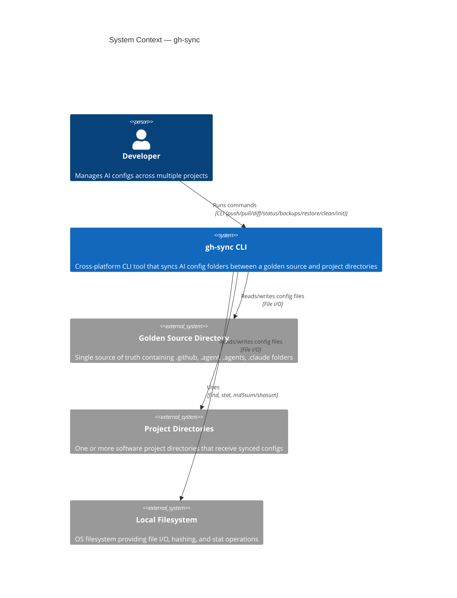
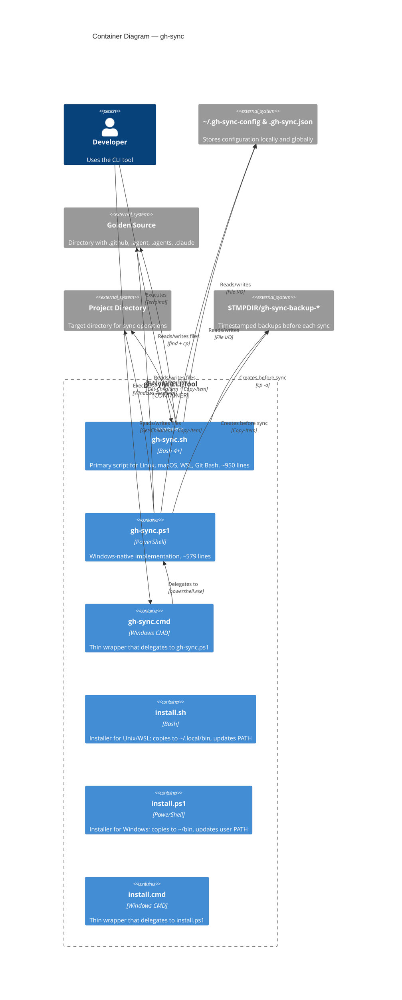
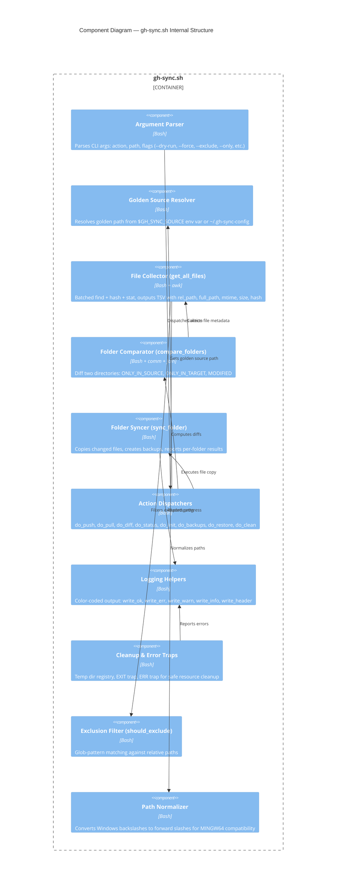
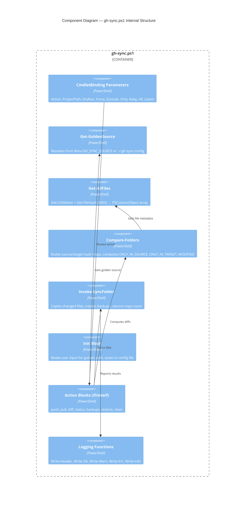
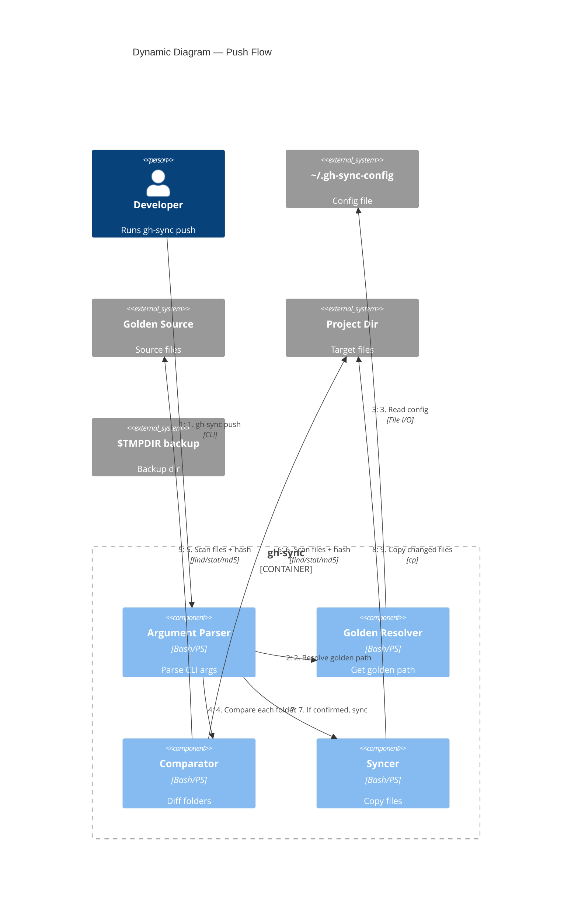
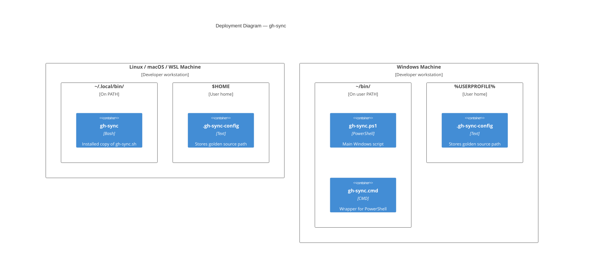
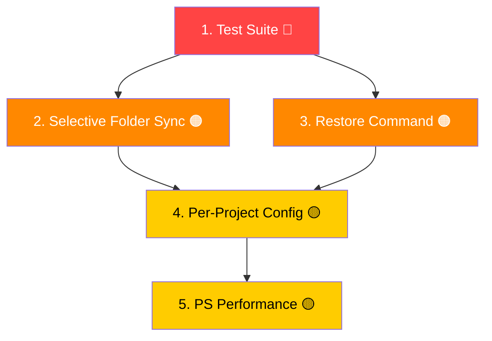

# gh-sync Complete Documentation

# 📚 gh-sync — Complete Project Documentation

> **Last Updated:** 2026-03-03  
> **Project Version:** 1.0.0  
> **Purpose:** Synchronize shared AI configuration folders across all your projects.

---

## Documentation Index

This folder contains a comprehensive documentation suite for the **gh-sync** project. Each document covers a specific aspect in depth so that any new developer can get up to speed quickly.

| # | Document | Description |
|---|----------|-------------|
| 01 | [Project Overview](./01-PROJECT-OVERVIEW.md) | What gh-sync is, why it exists, and the problem it solves |
| 02 | [Architecture](./02-ARCHITECTURE.md) | C4 diagrams, system design, and data flow |
| 03 | [File Structure](./03-FILE-STRUCTURE.md) | Every file and directory explained |
| 04 | [Core Concepts](./04-CORE-CONCEPTS.md) | Golden source, sync folders, hash comparison, backups |
| 05 | [CLI Reference](./05-CLI-REFERENCE.md) | All commands, options, and examples |
| 06 | [Bash Implementation](./06-BASH-IMPLEMENTATION.md) | Deep dive into `gh-sync.sh` (~950 lines) |
| 07 | [PowerShell Implementation](./07-POWERSHELL-IMPLEMENTATION.md) | Deep dive into `gh-sync.ps1` (~579 lines) |
| 08 | [Installation Guide](./08-INSTALLATION-GUIDE.md) | All install methods on every platform |
| 09 | [Golden Source Content](./09-GOLDEN-SOURCE-CONTENT.md) | What the synced folders contain (agents, skills, prompts) |
| 10 | [Developer Guide](./10-DEVELOPER-GUIDE.md) | How to contribute, coding conventions, extending the tool |
| 11 | [Improvement Plan](./11-IMPROVEMENT-PLAN.md) | 5 prioritized improvements with 25 sub-tasks |
| 12 | [AI & Git Workflow](./12-AI-GIT-WORKFLOW.md) | AI integrations, interactive menus, and conventional commits |

---

## Quick Start

```bash
# 1. Install (Linux/macOS/WSL)
bash install.sh

# 2. Configure golden source
gh-sync init

# 3. Sync to a project
cd ~/projects/my-app
gh-sync push
```

```powershell
# 1. Install (Windows)
.\install.cmd

# 2. Configure golden source
gh-sync init

# 3. Sync to a project
cd C:\Projects\MyApp
gh-sync push
```

---

## At a Glance

```
gh-sync
├── gh-sync.sh        # Bash implementation (Linux/macOS/WSL/Git Bash)
├── gh-sync.ps1       # PowerShell implementation (Windows native)
├── gh-sync.cmd       # Windows CMD wrapper for PowerShell
├── install.sh        # Bash installer
├── install.ps1       # PowerShell installer
├── install.cmd       # Windows CMD installer wrapper
├── README.md         # End-user README
├── skills-lock.json  # Lockfile for installed agent skills
├── .github/          # GitHub Copilot agents & prompts (synced content)
├── .agent/           # VS Code agent config (synced content)
├── .agents/          # Additional agent skills (synced content)
└── .claude/          # Claude Code skills (synced content)
```


---

# 01 — Project Overview

## What is gh-sync?

**gh-sync** is a cross-platform CLI tool that synchronizes AI-related configuration folders between a single **golden source** directory and any number of project directories.

In modern AI-assisted development, tools like GitHub Copilot, Claude Code, and VS Code agents rely on configuration files stored inside the project (`.github/`, `.agent/`, `.agents/`, `.claude/`). These files define:

- Agent behaviors and rules
- Reusable skills and workflows
- Memory banks and instructions
- Prompt templates

Maintaining these configs individually across dozens of projects is painful. **gh-sync** solves this by introducing a **single source of truth** (the "golden source") and bidirectional sync.

---

## The Problem

Imagine you have 15 projects and you want each to share the same AI agent skills, GitHub Copilot instructions, and Claude prompt templates. Without gh-sync, you would:

1. Manually copy files every time you update an agent skill
2. Forget which projects have the latest version
3. Risk config drift — projects gradually diverge
4. Spend time debugging why Copilot/Claude behaves differently per project

---

## The Solution

```
┌──────────────────────────────────┐
│       GOLDEN SOURCE              │
│  ~/ai-config-hub/                │
│  ├── .github/   (Copilot)        │
│  ├── .agent/    (VS Code)        │
│  ├── .agents/   (Skills)         │
│  └── .claude/   (Claude Code)    │
└──────────┬───────────────────────┘
           │  gh-sync push / pull
           │
    ┌──────┼──────────────────────┐
    │      │                      │
    ▼      ▼                      ▼
┌────────┐ ┌────────┐       ┌────────┐
│ Proj A │ │ Proj B │  ...  │ Proj N │
└────────┘ └────────┘       └────────┘
```

With gh-sync, you:

1. **Edit once** in the golden source
2. `gh-sync push` to propagate to any project
3. `gh-sync pull` to bring project-level improvements back
4. `gh-sync diff` / `gh-sync status` to see what's changed

---

## Key Features

| Feature | Description |
|---------|-------------|
| **Multi-folder sync** | Syncs `.github`, `.agent`, `.agents`, `.claude` in one command |
| **Selective sync** | Sync only specific folders (e.g. `--only .github`) |
| **Hash-based comparison** | Only files that actually changed are copied (MD5/SHA) |
| **Backup management** | Automatically backs up target folders, with CLI commands to list, restore, and clean backups |
| **Per-project config** | Support `.gh-sync.json` for per-project configuration defaults |
| **Non-destructive** | Files that exist only in the target are flagged but **never** deleted |
| **Cross-platform** | Bash (Linux, macOS, WSL, Git Bash) + PowerShell (Windows native) |
| **Dry-run mode** | Preview changes without writing anything |
| **Exclusion patterns** | Skip files matching glob patterns |
| **Per-folder reporting** | Results are broken down per sync folder with a grand total |
| **Defensive coding** | `set -Eeuo pipefail`, error traps, proper quoting |

---

## Design Philosophy

1. **Zero dependencies beyond the OS** — No Node.js, no Python, no package managers. Just bash or PowerShell.
2. **Safety first** — Dry-run, confirmation prompts, automatic backups, non-destructive defaults.
3. **Performance** — Batch hashing and stat calls instead of per-file subprocess spawning.
4. **Simplicity** — A single script per platform. No build step, no compilation.
5. **Portability** — Handles path normalization (Windows backslashes), cross-platform hash commands, Darwin vs GNU differences.

---

## Who Is This For?

- **Solo developers** maintaining AI configs across multiple projects
- **Teams** sharing a standardized AI agent/skill setup
- **AI tool enthusiasts** using Copilot, Claude, and custom VS Code agents who want consistency

---

## Version History

| Version | Date | Changes |
|---------|------|---------|
| 1.0.0 | 2026 | Initial release with push, pull, diff, status, init |
| 2.0.0 | 2026 | Added selective sync (`--only`), backup management (`backups`, `restore`, `clean`), `.gh-sync.json` configs, and PS optimizations |


---

# 02 — Architecture

This document describes the software architecture of gh-sync using **C4 model** diagrams (Mermaid syntax).

---

## Level 1 — System Context

This diagram shows gh-sync in the context of the people and external systems it interacts with.



---

## Level 2 — Container Diagram

gh-sync is a **standalone** CLI application with two parallel implementations. There is no server, no database, and no network communication.



---

## Level 3 — Component Diagram (Bash Implementation)

This breaks down the internal structure of `gh-sync.sh` — the most complex artifact in the project.



---

## Level 3 — Component Diagram (PowerShell Implementation)



---

## Dynamic Diagram — Push Flow

This shows the step-by-step sequence when a user runs `gh-sync push`.



---

## Deployment Diagram

gh-sync is a purely local tool — no servers, no cloud, no containers.



---

## Data Flow Summary

```
1. User runs: gh-sync <action> [path] [flags]

2. Argument parsing
   → Validate action (push|pull|diff|status|init|backups|restore|clean)
   → Extract --dry-run, --force, --exclude, --only, --keep, --all, --latest

3. Configuration & Golden source resolution
   → Check $GH_SYNC_SOURCE env var
   → Check local .gh-sync.json in project
   → Fallback: read ~/.gh-sync-config

4. For each sync folder (.github, .agent, .agents, .claude):
   a. Collect all files in source dir
      → find + batch md5sum/shasum + batch stat
      → Merge into TSV: rel_path | full_path | mtime | size | hash
      → Apply exclusion filters
   b. Collect all files in target dir (same process)
   c. Compare using sorted key diff:
      → comm -23: files only in source
      → comm -13: files only in target
      → join + hash compare: modified files

5. Display results (diff/status) or execute sync (push/pull):
   a. If --dry-run → show what would change, exit
   b. If not --force → prompt "Proceed? [y/N]"
   c. Create timestamped backup of target folder
   d. Copy changed files (ONLY_IN_SOURCE + MODIFIED)
   e. Report per-folder and grand-total stats
```


---

# 03 — File Structure

Every file and directory in the gh-sync project, explained in detail.

---

## Root Directory Layout

```
gh-sync/
│
│   ── Core Scripts ──────────────────────────────────────
├── gh-sync.sh            # Main Bash implementation (950 lines)
├── gh-sync.ps1           # Main PowerShell implementation (579 lines)
├── gh-sync.cmd           # Windows CMD wrapper → calls gh-sync.ps1
│
│   ── Installers ────────────────────────────────────────
├── install.sh            # Bash installer for Linux/macOS/WSL (136 lines)
├── install.ps1           # PowerShell installer for Windows (71 lines)
├── install.cmd           # Windows CMD wrapper → calls install.ps1
│
│   ── Documentation ────────────────────────────────────
├── README.md             # End-user documentation (146 lines)
│
│   ── Metadata ──────────────────────────────────────────
├── skills-lock.json      # Lock file for installed agent skills
│
│   ── Golden Source Content (synced folders) ────────────
├── .github/              # GitHub Copilot agents, prompts, instructions
│   ├── agents/           # 10 agent definition files
│   └── prompts/          # 9 prompt template files
│
├── .agent/               # VS Code agent-specific config
│   └── skills/           # VS Code agent skills
│       └── c4-architecture/
│
├── .agents/              # Shared agent skills
│   └── skills/           # 5 installed skills
│       ├── c4-architecture/
│       ├── tailwind-design-system/
│       ├── ui-ux-pro-max/
│       ├── vercel-deployment/
│       └── vercel-react-best-practices/
│
├── .claude/              # Claude Code config
│   └── skills/           # Claude-specific skills
│
│   ── Git / Hidden ──────────────────────────────────────
├── .git/                 # Git repository
└── .claude/              # Claude Code configuration
```

---

## File-by-File Breakdown

### `gh-sync.sh` — Bash Implementation

| Property | Value |
|----------|-------|
| **Language** | Bash 4+ |
| **Size** | ~950 lines, ~32 KB |
| **Platforms** | Linux, macOS, WSL, Git Bash (MINGW64) |
| **Entry point** | `main()` function at line 905 |

This is the **primary** implementation. It contains:
- Constants definition (`SYNC_FOLDERS`, `CONFIG_FILE`, `VERSION`)
- Color-coded logging helpers
- Temp dir management with cleanup traps
- Argument parser (`parse_args`)
- Golden source resolution (`get_golden_source`)
- Path normalization for Windows/MINGW compatibility
- Batched file collection with `find + md5sum/stat + awk` (`get_all_files`)
- Folder comparison using `comm` and `join` (`compare_folders`)
- Sync engine with backup support (`sync_folder`)
- Five action dispatchers: `do_init`, `do_push`, `do_pull`, `do_diff`, `do_status`

### `gh-sync.ps1` — PowerShell Implementation

| Property | Value |
|----------|-------|
| **Language** | PowerShell |
| **Size** | ~579 lines, ~20 KB |
| **Platforms** | Windows (PowerShell 5.1+) |
| **Entry point** | Script-level `param()` block + `if/elseif` action routing |

Feature-parity PowerShell port. Uses:
- `CmdletBinding` with `[ValidateSet]` for action validation
- `Get-ChildItem` + `Get-FileHash` instead of `find + md5sum`
- PowerShell `[PSCustomObject]` arrays for file metadata
- Same `Compare-Folders` / `Invoke-SyncFolder` pattern
- Identical logging function signatures

### `gh-sync.cmd` — Windows CMD Wrapper

| Property | Value |
|----------|-------|
| **Size** | 6 lines |
| **Purpose** | Allows running `gh-sync` from `cmd.exe` |

```bat
@echo off
powershell.exe -NoProfile -ExecutionPolicy Bypass -File "%~dp0gh-sync.ps1" %*
```

Simply forwards all arguments to `gh-sync.ps1` via PowerShell. The `-ExecutionPolicy Bypass` flag ensures it works even on systems with restricted script execution policies.

### `install.sh` — Bash Installer

| Property | Value |
|----------|-------|
| **Size** | ~136 lines, ~4.7 KB |
| **Installs to** | `~/.local/bin/gh-sync` (or `~/bin/gh-sync`) |

Steps:
1. Creates bin directory (`~/.local/bin` or `~/bin`)
2. Copies `gh-sync.sh` → `gh-sync` with execute permissions
3. Adds bin directory to `PATH` in the appropriate shell RC file (`.bashrc`, `.zshrc`, `.bash_profile`, `config.fish`)
4. Prints next-step instructions

### `install.ps1` — PowerShell Installer

| Property | Value |
|----------|-------|
| **Size** | ~71 lines, ~2.9 KB |
| **Installs to** | `%USERPROFILE%\bin\` |

Steps:
1. Creates `~/bin` directory
2. Copies `gh-sync.ps1` and `gh-sync.cmd` to `~/bin`
3. Adds `~/bin` to the user-level `PATH` environment variable
4. Prints next-step instructions

### `install.cmd` — Windows CMD Installer Wrapper

| Property | Value |
|----------|-------|
| **Size** | 8 lines |
| **Purpose** | Double-clickable installer for Windows |

Delegates to `install.ps1` and pauses at the end so the user can read the output.

### `README.md` — User-Facing README

| Property | Value |
|----------|-------|
| **Size** | ~146 lines, ~4.1 KB |

Standard GitHub README with:
- Requirements
- Installation instructions (one-liner and manual)
- First-time setup (`gh-sync init`)
- Usage table (push, pull, diff, status, init)
- Options table (--dry-run, --force, --exclude, -h, -v)
- How-it-works summary
- Diff output legend ([+], [-], [~])
- Uninstall instructions

### `skills-lock.json` — Skills Lock File

```json
{
  "version": 1,
  "skills": {
    "c4-architecture": {
      "source": "softaworks/agent-toolkit",
      "sourceType": "github",
      "computedHash": "9192b5d6..."
    }
  }
}
```

Tracks installed agent skills with their source repositories and content hashes. Similar in concept to `package-lock.json` — ensures reproducible skill installations.

---

## Synced Folder Contents

These are the **golden source**'s synced directories. They are themselves part of the gh-sync project repo, acting as the reference copy.

### `.github/agents/` — 10 Copilot Agent Definitions

| File | Size | Purpose |
|------|------|---------|
| `copilot-instructions.md` | 853 B | General Copilot instructions/rules |
| `speckit.analyze.agent.md` | 7.2 KB | SpecKit analysis agent |
| `speckit.checklist.agent.md` | 16.8 KB | SpecKit checklist agent |
| `speckit.clarify.agent.md` | 11.3 KB | SpecKit clarification agent |
| `speckit.constitution.agent.md` | 5.5 KB | SpecKit constitutional rules agent |
| `speckit.implement.agent.md` | 7.5 KB | SpecKit implementation agent |
| `speckit.plan.agent.md` | 3.4 KB | SpecKit planning agent |
| `speckit.specify.agent.md` | 12.9 KB | SpecKit specification agent |
| `speckit.tasks.agent.md` | 6.4 KB | SpecKit task management agent |
| `speckit.taskstoissues.agent.md` | 1.1 KB | SpecKit tasks-to-issues converter agent |

### `.github/prompts/` — 9 Prompt Templates

Each prompt is a minimal trigger file (28–37 bytes) paired with its corresponding agent:

| File | Paired Agent |
|------|-------------|
| `speckit.analyze.prompt.md` | speckit.analyze.agent |
| `speckit.checklist.prompt.md` | speckit.checklist.agent |
| `speckit.clarify.prompt.md` | speckit.clarify.agent |
| `speckit.constitution.prompt.md` | speckit.constitution.agent |
| `speckit.implement.prompt.md` | speckit.implement.agent |
| `speckit.plan.prompt.md` | speckit.plan.agent |
| `speckit.specify.prompt.md` | speckit.specify.agent |
| `speckit.tasks.prompt.md` | speckit.tasks.agent |
| `speckit.taskstoissues.prompt.md` | speckit.taskstoissues.agent |

### `.agents/skills/` — 5 Installed Skills

| Skill | Files | Purpose |
|-------|-------|---------|
| `c4-architecture` | 5 files | Generate C4 architecture diagrams |
| `tailwind-design-system` | 1 file | Build Tailwind CSS v4 design systems |
| `ui-ux-pro-max` | 3 files | UI/UX design intelligence (50 styles, 21 palettes, etc.) |
| `vercel-deployment` | 1 file | Deploy to Vercel with Next.js |
| `vercel-react-best-practices` | 60 files | React/Next.js performance optimization guidelines |

### `.agent/skills/` — VS Code Agent Skills

Contains the `c4-architecture` skill definition for the VS Code agent system.

### `.claude/skills/` — Claude Code Skills

Reserved directory for Claude Code-specific skill definitions.


---

# 04 — Core Concepts

This document explains the fundamental concepts behind gh-sync. Understanding these will make the code and behavior intuitive.

---

## 1. Golden Source

The **golden source** is a single directory on your machine that serves as the **single source of truth** for all your AI configuration files.

### What It Contains

The golden source directory has up to four subfolders:

```
~/my-golden-source/
├── .github/    →  GitHub Copilot agents, skills, memory bank, instructions
├── .agent/     →  VS Code agent rules, skills, workflows
├── .agents/    →  Additional shared agent skills
└── .claude/    →  Claude Code skills and configuration
```

### How It's Configured

The golden source path is stored in one of two places (checked in this order):

1. **Environment variable** `GH_SYNC_SOURCE` — highest priority
2. **Project config file** `.gh-sync.json` — in the project root
3. **Global config file** `~/.gh-sync-config` — set via `gh-sync init`

The config file is a single-line text file containing the absolute path:

```
/home/user/ai-config-hub
```

### Why Not Git Submodules?

Git submodules could solve a similar problem, but:
- They require all projects to be Git repos
- They introduce complex merge/update workflows
- They can't handle partial syncs (per-folder)
- They don't support exclusion patterns or dry-run previews
- gh-sync works with any directory, Git or not

---

## 2. Sync Folders

gh-sync operates on exactly **four folder names**. These are hardcoded as constants:

```bash
# Bash
readonly SYNC_FOLDERS=(".github" ".agent" ".agents" ".claude")

# PowerShell
$SYNC_FOLDERS = @(".github", ".agent", ".agents", ".claude")
```

### Per-Folder Independence

Each folder is synced independently. This means:
- By default, all four folders are processed in sequence.
- Users can filter which folders are synced using the `--only f1,f2` flag (e.g. `--only .github,.agents`).
- If `.github/` exists in the golden source but `.claude/` doesn't, only `.github/` is synced
- Folders not present in the golden source are silently skipped
- Folders not present in the project target are created on `push`
- All reporting (diff, status) is broken down per folder with a grand total

### Why These Four?

| Folder | AI Tool | Convention |
|--------|---------|------------|
| `.github/` | GitHub Copilot | Standard GitHub convention for Copilot agents, instructions, and memory banks |
| `.agent/` | VS Code Agent | VS Code extension convention for agent rules and skills |
| `.agents/` | Cross-platform agents | Additional skill libraries shared across multiple tools |
| `.claude/` | Claude Code | Anthropic's Claude Code extension skill convention |

---

## 3. Hash-Based Comparison

gh-sync determines if a file has changed by comparing **content hashes**, not just timestamps or file sizes.

### Hash Command Detection

At startup, the script detects the available hash command (checked in order):

```bash
if command -v md5sum &>/dev/null; then
    _HASH_CMD="md5sum"
elif command -v md5 &>/dev/null; then
    _HASH_CMD="md5"
elif command -v shasum &>/dev/null; then
    _HASH_CMD="shasum"
```

| Platform | Typical Hash Command |
|----------|---------------------|
| Linux | `md5sum` |
| macOS | `md5` (BSD) or `shasum` |
| Windows (Git Bash) | `md5sum` (from coreutils) |
| Windows (PowerShell) | `Get-FileHash -Algorithm MD5` |

### Why Hashes, Not Timestamps?

Timestamps can lie:
- Copying a file may update its `mtime` to "now" even though the content is unchanged
- Git operations (checkout, rebase) may reset timestamps
- Timezone differences across machines can cause false positives

By comparing MD5/SHA hashes, gh-sync accurately detects **actual content changes**.

### Timestamp as Tiebreaker

When a file IS modified (hash mismatch), the modification time (`mtime`) is used to determine **which side is newer**. The diff output says "newer in Golden" or "newer in Project" accordingly.

---

## 4. File Collection Pipeline

The Bash implementation uses a highly optimized, **batched** file collection strategy. Instead of spawning subprocesses per file (which is slow on large folder trees), it uses a 3-step pipeline:

### Step 1: Batch Hash

One single `find ... -exec md5sum {} +` call hashes ALL files in the directory. The `+` terminator makes `find` batch arguments, so only 1–2 subprocess forks happen regardless of file count.

### Step 2: Batch Stat

One single `find ... -printf '%T@|%s|%p\n'` call (GNU) or `find ... -exec stat -f '%m|%z|%N' {} +` (macOS) gets modification time and file size for ALL files.

### Step 3: Merge with AWK

A single `awk` invocation merges the hash and stat data by filepath, computing relative paths and outputting a clean TSV:

```
RELATIVE_PATH\tFULL_PATH\tMTIME_EPOCH\tSIZE\tHASH
```

### Performance Impact

| Approach | Subprocesses for 1000 files |
|----------|----------------------------|
| Per-file hash/stat (naive) | ~3000 forks |
| Batched pipeline (gh-sync) | ~4 forks total |

This makes gh-sync performant even on large config directories with hundreds of files.

---

## 5. Folder Comparison

Once file metadata is collected for both source and target, the comparison uses Unix set operations:

```bash
# Extract sorted file keys
awk '{print $1}' source.tsv | sort > sk.txt
awk '{print $1}' target.tsv | sort > tk.txt

# Files only in source (to be pushed)
comm -23 sk.txt tk.txt → ONLY_IN_SOURCE

# Files only in target (project-specific, not deleted)
comm -13 sk.txt tk.txt → ONLY_IN_TARGET

# Files in both: join by key, compare hashes
join sk.txt tk.txt → check hash equality → MODIFIED
```

### Comparison Results

| Status | Meaning | Push Action | Pull Action |
|--------|---------|-------------|-------------|
| `ONLY_IN_SOURCE` | File exists in source but not target | **Copied to target** | **Copied to target** |
| `ONLY_IN_TARGET` | File exists in target but not source | Flagged ⚠️, **never deleted** | Flagged ⚠️, **never deleted** |
| `MODIFIED` | File exists in both but content differs | **Overwritten** (source wins) | **Overwritten** (source wins) |

> **Key safety guarantee:** gh-sync **never deletes files**. Files only in the target are flagged but preserved.

---

## 6. Backup Strategy

Before any sync operation modifies the target, gh-sync creates a full backup:

```bash
# Bash
backup_dir="$(mktemp -d "${TMPDIR:-/tmp}/gh-sync-backup-${folder}-${timestamp}.XXXXXX")"
cp -a "$target_dir/." "$backup_dir/"
```

```powershell
# PowerShell
$backupDir = Join-Path ([System.IO.Path]::GetTempPath()) "gh-sync-backup-$folderName-$timestamp"
Copy-Item -Path $targetDir -Destination $backupDir -Recurse -Force
```

### Backup Location

| Platform | Backup Path |
|----------|-------------|
| Linux | `/tmp/gh-sync-backup-github-20260303-094117.XXXXXX/` |
| macOS | `$TMPDIR/gh-sync-backup-github-20260303-094117.XXXXXX/` |
| Windows | `%TEMP%\gh-sync-backup-.github-20260303-094117\` |

### Managing Backups

Unlike manual temporary files, `gh-sync` provides built-in commands to list, restore, and clear these backups:

- **`gh-sync backups`**: Lists the available backups found in the temp directory.
- **`gh-sync restore [num/folder]`**: Restores the previously stored contents to the target directory. Add `--latest` to restore the last backup for a given folder.
- **`gh-sync clean --keep N`**: Keeps the specified number of the most recent backups per folder and deletes the rest.

### Backup Properties

- **One per sync folder** — `.github`, `.agent`, `.agents`, `.claude` each get their own backup
- **Timestamped** — Format: `YYYYMMDD-HHMMSS`
- **Temporary** — Stored in the OS temp directory, cleaned up automatically by OS policies over time or manually with `gh-sync clean`
- **Full copy** — The entire target folder is backed up, not just changed files
- **Only on actual writes** — Dry-run mode does NOT create backups

---

## 7. Safety Mechanisms

gh-sync implements multiple layers of safety:

### 1. Confirmation Prompt

By default, push and pull operations require explicit user confirmation:

```
  Proceed with PUSH? [y/N]
```

Skippable with `--force` for scripting/CI use.

### 2. Dry-Run Mode

`--dry-run` shows exactly what would happen without writing any files:

```bash
gh-sync push --dry-run
```

### 3. Non-Destructive Default

Files only in the target are **never deleted**, only flagged:

```
  [!!] extra-file.md     # Flagged but left alone
```

### 4. Error Traps (Bash)

```bash
set -Eeuo pipefail     # Exit on error, undefined vars, pipe failures
trap cleanup EXIT      # Always clean up temp files
trap on_error ERR      # Report error location
```

### 5. Temp Dir Registry

The bash script maintains an array (`_TEMP_DIRS`) of all temporary directories. The `EXIT` trap ensures all are cleaned up, even if the script crashes.

---

## 8. Exclusion Patterns

Users can exclude files from sync using glob patterns:

```bash
gh-sync push --exclude "*.log,node_modules/*,*.tmp"
```

### How It Works

```bash
# Bash: pattern matching using case statement
should_exclude() {
    local rel_path="$1"
    for pattern in "${EXCLUDE_PATTERNS[@]}"; do
        case "$rel_path" in
            $pattern) return 0 ;;  # Match found, exclude
        esac
    done
    return 1  # No match, include
}
```

```powershell
# PowerShell: -like operator
function Test-ShouldExclude {
    param([string]$relativePath)
    foreach ($pattern in $script:Exclude) {
        if ($relativePath -like $pattern) { return $true }
    }
    return $false
}
```

Patterns are matched against **relative paths** within each sync folder.

---

## 9. Path Normalization

On Windows (Git Bash / MINGW64), paths may contain backslashes. gh-sync normalizes all paths to forward slashes:

```bash
normalize_path() {
    echo "${1//\\//}"
}
```

This prevents issues with awk, find, and other Unix tools that interpret backslashes as escape characters.

**Also critical:** The `awk` merge step uses `ENVIRON["AWK_BASE"]` instead of `-v base="$folder"` to avoid awk interpreting backslashes in Windows paths as escape sequences (e.g., `\U` → unicode escape).

---

## 10. Per-Project Configuration File

To avoid repeating the same command-line flags on every run, gh-sync supports a per-project `.gh-sync.json` configuration file located in the project's root directory.

### Format and Precedence

The file allows configuring default behaviors for a specific project:

```json
{
  "golden_source": "~/alternative-golden-source",
  "exclude": ["*.log", "temp/*"],
  "only": [".github", ".agents"]
}
```

Precedence order (highest to lowest):
1. Command Line Flags (`--only`, `--exclude`)
2. Project-level `.gh-sync.json`
3. Global file `~/.gh-sync-config` / Default settings

This ensures maximum flexibility where a project can define its own default sync rules, but users can still override them ad-hoc via the CLI.


---

# 05 — CLI Reference

Complete command-line reference for the `gh-sync` tool.

---

## Synopsis

```
gh-sync <action> [project_path] [options]
```

---

## Actions

### `gh-sync init`

Configure the golden source directory path.

```bash
gh-sync init
```

**Interactive prompts:**
1. Asks for the path to your golden source directory
2. Shows which sync folders (`.github`, `.agent`, `.agents`, `.claude`) exist and their file counts
3. Saves the path to `~/.gh-sync-config`

**Notes:**
- Run this once before using any other command
- If the path doesn't exist, it offers to create it
- Tilde expansion (`~`) is supported
- Alternative: Set the `GH_SYNC_SOURCE` environment variable instead

---

### `gh-sync push [project_path]`

Copy files from the golden source → project directory.

```bash
# Push to current directory
gh-sync push

# Push to a specific project
gh-sync push ~/projects/my-app

# Push with options
gh-sync push --dry-run
gh-sync push --force
gh-sync push --exclude "*.log,temp/*"
gh-sync push --only .github
```

**Behavior:**
1. Compares each sync folder (golden vs project)
2. Shows a summary of changes per folder
3. Prompts for confirmation (unless `--force`)
4. Creates a timestamped backup of each target folder
5. Copies new and modified files from golden → project
6. Reports per-folder and total files synced

**What gets copied:**
- Files only in golden source → **copied** to project
- Files modified (different hash) → **overwritten** in project
- Files only in project → **kept** (flagged, not deleted)

---

### `gh-sync pull [project_path]`

Copy files from project directory → golden source.

```bash
# Pull from current directory
gh-sync pull

# Pull from a specific project
gh-sync pull ~/projects/my-app
```

**Behavior:**
Same as `push` but with reversed direction:
- Source = project directory
- Target = golden source

Use this when you've made improvements to AI configs in a specific project and want to propagate them back to the golden source.

---

### `gh-sync diff [project_path]`

Show file-by-file differences between golden source and project.

```bash
gh-sync diff
gh-sync diff ~/projects/my-app
```

**Output:**
```
=== DIFF: Golden Source <-> Project ===
  ->  Golden:  /home/user/golden-source
  ->  Project: /home/user/projects/my-app

  --- .github ---
  [+] agents/new-agent.md
      Only in Golden
  [-] prompts/old-prompt.md
      Only in Project
  [~] agents/speckit.analyze.agent.md
      Different (newer in Golden)

  --- .agents ---
  [OK] In sync

  [!!] 3 total difference(s) found.
```

**Legend:**

| Symbol | Color | Meaning |
|--------|-------|---------|
| `[+]` | 🟢 Green | File only in golden source (would be copied on push) |
| `[-]` | 🔴 Red | File only in project (kept, never deleted) |
| `[~]` | 🟡 Yellow | File exists in both but content differs |

---

### `gh-sync status [project_path]`

Quick overview of sync state per folder with totals.

```bash
gh-sync status
gh-sync status ~/projects/my-app
```

**Output:**
```
=== STATUS: Sync Overview ===
  ->  Golden:  /home/user/golden-source
  ->  Project: /home/user/projects/my-app

  --- .github ---
    In sync:         18
    Only in Golden:  2
    Only in Project: 1
    Modified:        3

  --- .agents ---
    In sync:         65
    Only in Golden:  0
    Only in Project: 0
    Modified:        0

  === TOTAL ===
    In sync:         83 files
    Only in Golden:  2 files
    Only in Project: 1 files
    Modified:        3 files
```

---

### `gh-sync backups`

List all available backups in the temporary directory.

```bash
gh-sync backups
```

**Output:**
Displays numbered backups sorted by date (most recent first) with the folder name, timestamp, path, and file count.

---

### `gh-sync restore`

Restore files from a previous backup. 

```bash
# Restore specific backup by ID
gh-sync restore 1

# Restore the most recent backup for a specific folder
gh-sync restore .github --latest

# Restore without confirming
gh-sync restore 1 --force
```

**Behavior:**
1. Verifies the backup exists.
2. Prompts before overwrite unless `--force` is used.
3. Copies all files from the backup directory back to the specific project target directory, overwriting current files.

---

### `gh-sync clean`

Remove old automatic backups from the temporary directory.

```bash
# Keep only the last 5 backups total
gh-sync clean --keep 5

# Remove all backups
gh-sync clean --all
```

**Behavior:**
1. Requires either `--keep` or `--all`.
2. Asks for confirmation before deletion unless `--force` is supplied.
3. Removes the specified number of older backup directories.

---

## Options

### `--dry-run`

Preview changes without modifying any files. Works with `push` and `pull`.

```bash
gh-sync push --dry-run
gh-sync pull --dry-run
```

When active, the tool:
- Shows what would be copied
- Shows what would be skipped
- Does NOT create backups
- Does NOT write any files
- Displays a warning: "Dry-run mode -- no files were changed."

---

### `--force`

Skip the "Proceed? [y/N]" confirmation prompt. Useful for scripting and CI.

```bash
gh-sync push --force
gh-sync pull --force
```

---

### `--exclude pat1,pat2`

Exclude files matching glob patterns (comma-separated). Patterns are matched against **relative paths** within each sync folder.

```bash
# Single pattern
gh-sync push --exclude "*.log"

# Multiple patterns (comma-separated)
gh-sync push --exclude "*.log,*.tmp,node_modules/*"

# Also supports = syntax
gh-sync push --exclude="*.log,temp/*"
```

**Pattern examples:**

| Pattern | Matches |
|---------|---------|
| `*.log` | All `.log` files |
| `temp/*` | Everything inside `temp/` subdirectory |
| `*.md` | All Markdown files |
| `agents/*.bak` | Backup files in the `agents/` subfolder |

---

### `--only folder1,folder2`

Sync only specified folders instead of all supported folders (comma-separated). The values must match one or more of `.github`, `.agent`, `.agents`, or `.claude`.

```bash
# Sync only .github
gh-sync push --only .github

# Sync multiple specific folders
gh-sync push --only .github,.agents
```

---

### `-h`, `--help`

Show the help message with usage summary.

```bash
gh-sync --help
gh-sync -h
```

---

### `-v`, `--version`

Show the current version.

```bash
gh-sync --version
gh-sync -v
# Output: gh-sync 1.0.0
```

---

## Project Path

The optional `project_path` argument specifies the target project directory:

```bash
# Uses current directory (default)
gh-sync push

# Explicit project path
gh-sync push /path/to/project

# Relative path works too
gh-sync push ../other-project
```

If not provided, defaults to `$(pwd)` (Bash) or `Get-Location` (PowerShell).

---

## Configuration Priority

The golden source path is resolved in this order:

| Priority | Source | Example |
|----------|--------|---------|
| 1 (highest) | `$GH_SYNC_SOURCE` env var | `export GH_SYNC_SOURCE=~/golden` |
| 2 | `~/.gh-sync-config` file | Set via `gh-sync init` |

If neither is set, the tool exits with an error asking you to run `gh-sync init`.

---

## Exit Codes

| Code | Meaning |
|------|---------|
| `0` | Success (or user aborted gracefully) |
| `1` | Error (missing config, invalid path, missing hash command) |
| Non-zero | Unexpected error (trapped by `set -Eeuo pipefail`) |

---

## PowerShell-Specific Notes

On Windows, the same commands work but use PowerShell parameter syntax:

```powershell
# PowerShell native parameters
gh-sync push -DryRun
gh-sync push -Force
gh-sync push -Exclude "*.log","*.tmp"
gh-sync push C:\Projects\MyApp -DryRun -Force

# CMD wrapper (passes args to PowerShell)
gh-sync.cmd push --dry-run
```

The `.cmd` wrapper translates standard CLI flags to PowerShell parameters internally via `%*` argument forwarding.

---

## Configuration File

Projects can have a `.gh-sync.json` file placed in their root to define default arguments. For more information, see `04-CORE-CONCEPTS.md`.


---

# 06 — Bash Implementation Deep Dive

Complete technical breakdown of `gh-sync.sh` — the primary implementation (~950 lines).

---

## Script Header & Safety

```bash
#!/bin/bash
set -Eeuo pipefail
```

| Flag | Effect |
|------|--------|
| `-E` | ERR traps are inherited by functions, subshells, and command substitutions |
| `-e` | Exit immediately on any command failure |
| `-u` | Treat unset variables as errors |
| `-o pipefail` | Return the exit code of the first failing pipe command, not the last |

This is the **strictest** Bash error mode. Any unhandled error terminates the script immediately.

---

## Constants (Lines 19–22)

```bash
readonly SYNC_FOLDERS=(".github" ".agent" ".agents" ".claude")
readonly CONFIG_FILE="${HOME}/.gh-sync-config"
readonly VERSION="1.0.0"
```

- `SYNC_FOLDERS` — Array of four folder names to synchronize
- `CONFIG_FILE` — Path to the persistent config storing the golden source path
- `VERSION` — Displayed by `--version` and in the `--help` output

---

## Logging System (Lines 29–44)

Color-coded output helpers using ANSI escape sequences:

| Function | Prefix | Color | Output |
|----------|--------|-------|--------|
| `write_header()` | `=== ... ===` | Cyan | Section headers |
| `write_ok()` | `[OK]` | Green | Success messages |
| `write_warn()` | `[!!]` | Yellow | Warnings |
| `write_err()` | `[ERR]` | Red | Errors (→ stderr) |
| `write_info()` | `->` | Gray | Informational |
| `write_colored()` | — | Custom | Arbitrary color + message |

All error output goes to `stderr` (`>&2`), keeping `stdout` clean for piping.

---

## Cleanup & Error Traps (Lines 46–67)

### Temp Dir Registry

```bash
_TEMP_DIRS=()

register_temp_dir() { _TEMP_DIRS+=("$1"); }

cleanup() {
    for _d in "${_TEMP_DIRS[@]}"; do
        [[ -d "$_d" ]] && rm -rf -- "$_d"
    done
    _TEMP_DIRS=()
}
```

Every time a function creates a temp directory (via `mktemp -d`), it registers it. The `EXIT` trap calls `cleanup()` to remove all registered temp dirs.

### Why Not One Global Temp Dir?

The `ERR` trap could fire inside a nested function, and if `cleanup()` deleted a temp dir that an outer function was still using, it would cascade into more errors. The comment in the code explicitly warns:

> "Do NOT call cleanup here — let the EXIT trap handle it."

### Traps

```bash
trap cleanup EXIT   # Always runs, even on success
trap on_error ERR   # Reports error location (line number)
```

---

## Argument Parser (Lines 110–185)

The `parse_args()` function processes all command-line arguments:

```bash
parse_args() {
    ACTION="$1"
    shift

    case "$ACTION" in
        push|pull|diff|status|init) ;;     # Valid actions
        -h|--help) usage 0 ;;
        -v|--version) echo "gh-sync ${VERSION}"; exit 0 ;;
        *) write_err "Unknown action: $ACTION"; usage 1 ;;
    esac

    while [[ $# -gt 0 ]]; do
        case "$1" in
            --dry-run)   DRY_RUN=true; shift ;;
            --force)     FORCE=true; shift ;;
            --exclude)   IFS=',' read -ra EXCLUDE_PATTERNS <<< "$2"; shift 2 ;;
            --exclude=*) IFS=',' read -ra EXCLUDE_PATTERNS <<< "${1#*=}"; shift ;;
            --only)      IFS=',' read -ra ONLY_FOLDERS <<< "$2"; shift 2 ;;
            --only=*)    IFS=',' read -ra ONLY_FOLDERS <<< "${1#*=}"; shift ;;
            --latest)    LATEST=true; shift ;;
            --all)       ALL=true; shift ;;
            --keep)      KEEP="$2"; shift 2 ;;
            --keep=*)    KEEP="${1#*=}"; shift ;;
            -*)          write_err "Unknown option: $1"; usage 1 ;;
            *)           PROJECT_PATH="$1"; shift ;;  # Positional arg
        esac
    done

    # Default project path to current directory
    [[ -z "$PROJECT_PATH" ]] && PROJECT_PATH="$(pwd)"
}
```

**Key design decisions:**
- First positional argument is always the action
- Second positional argument (optional) is the project path
- `--exclude`, `--only`, and `--keep` support both value syntax (space and `=`)
- Comma-separated patterns and folder lists are split into arrays via `IFS=','`
- New `--latest` and `--all` boolean flags for backup management

---

## Configuration File Loading

The `load_project_config()` function checks for `.gh-sync.json` in the target project.

```bash
load_project_config() {
    local config_file="$1/.gh-sync.json"
    [[ ! -f "$config_file" ]] && return

    # Uses a python command or jq fallback
    # ...
}
```

This allows projects to define `exclude` patterns, `only` folder selections, and a customized `golden_source` without requiring CLI parameters. CLI flags still override these values.

---

## Golden Source Resolution (Lines 188–207)

```bash
get_golden_source() {
    # 1. Environment variable (highest priority)
    if [[ -n "${GH_SYNC_SOURCE:-}" ]]; then
        normalize_path "$GH_SYNC_SOURCE"
        return
    fi

    # 2. Config file
    if [[ -f "$CONFIG_FILE" ]]; then
        local path
        path="$(head -1 "$CONFIG_FILE" | tr -d '[:space:]')"
        path="$(normalize_path "$path")"
        if [[ -n "$path" && -d "$path" ]]; then
            echo "$path"
            return
        fi
    fi

    echo ""
}
```

**Notes:**
- `${GH_SYNC_SOURCE:-}` prevents unset-variable errors under `set -u`
- Config file is read with `head -1` (only first line matters)
- All paths are normalized (backslashes → forward slashes)
- An empty string return is explicitly handled by the caller

---

## Hash Detection (Lines 230–239)

```bash
if command -v md5sum &>/dev/null; then
    _HASH_CMD="md5sum"
elif command -v md5 &>/dev/null; then
    _HASH_CMD="md5"
elif command -v shasum &>/dev/null; then
    _HASH_CMD="shasum"
else
    write_err "No hash command found"
    exit 1
fi
```

This runs once at script startup, not per-file. The detected command is stored in a global variable and used throughout.

---

## File Collection: `get_all_files()` (Lines 250–339)

This is the **performance-critical** function. It collects metadata for all files in a directory using batched operations.

### Step 1: Batch Hash (Lines 258–269)

```bash
case "$_HASH_CMD" in
    md5sum)
        find "$folder" -type f -exec md5sum -- {} + > "$tmp_work/hashes.raw" ;;
    md5)
        find "$folder" -type f -exec md5 -r -- {} + > "$tmp_work/hashes.raw" ;;
    shasum)
        find "$folder" -type f -exec shasum -a 256 -- {} + > "$tmp_work/hashes.raw" ;;
esac
```

The `+` terminator (instead of `\;`) tells `find` to batch multiple file arguments into a single command invocation. This is dramatically faster.

### Step 2: Batch Stat (Lines 273–280)

```bash
if [[ "$_IS_DARWIN" == "true" ]]; then
    # macOS: stat -f with pipe-delimited format
    find "$folder" -type f -exec stat -f '%m|%z|%N' {} +
else
    # GNU: find's built-in -printf (ZERO extra subprocesses)
    find "$folder" -type f -printf '%T@|%s|%p\n'
fi
```

On GNU/Linux, `find -printf` is a **built-in** that requires zero subprocess forks. On macOS (Darwin), `stat -f` is used with a pipe-delimited format.

### Step 3: AWK Merge (Lines 282–326)

A single `awk` invocation reads both files and produces the merged output:

```bash
AWK_BASE="$folder" awk '
BEGIN { base = ENVIRON["AWK_BASE"] }
# Pass 1: Build hash lookup table from hashes.raw
NR == FNR {
    hash = $1
    sub(/^[^ ]+ +\*?/, "")  # Remove hash + spaces + optional binary marker
    hashes[$0] = hash
    next
}
# Pass 2: Read stats.raw, join with hashes, output TSV
{
    # Parse pipe-delimited: MTIME|SIZE|FILEPATH
    n = index($0, "|")
    mtime = substr($0, 1, n-1)
    rest = substr($0, n+1)
    n2 = index(rest, "|")
    size = substr(rest, 1, n2-1)
    filepath = substr(rest, n2+1)

    # Compute relative path
    rel = filepath
    idx = index(rel, base)
    if (idx == 1) {
        rel = substr(rel, length(base) + 1)
        sub(/^\//, "", rel)
    }

    h = hashes[filepath]
    if (h == "") h = "unknown"

    printf "%s\t%s\t%s\t%s\t%s\n", rel, filepath, mtime, size, h
}
' "$tmp_work/hashes.raw" "$tmp_work/stats.raw"
```

**Key technique:** `ENVIRON["AWK_BASE"]` is used instead of `-v base="$folder"` because awk's `-v` flag interprets backslash sequences in the value string. On Windows paths like `C:\Users`, `\U` would be interpreted as an escape sequence, corrupting the path.

### Step 4: Exclusion Filter (Lines 328–336)

After the merge, exclusion patterns are applied in pure Bash (no forks):

```bash
if [[ ${#EXCLUDE_PATTERNS[@]} -gt 0 ]]; then
    while IFS=$'\t' read -r rel rest; do
        should_exclude "$rel" && continue
        printf '%s\t%s\n' "$rel" "$rest"
    done < "$tmp_work/merged.tsv"
else
    cat "$tmp_work/merged.tsv"
fi
```

---

## Folder Comparison: `compare_folders()` (Lines 346–403)

Uses Unix `comm` for O(n) set operations:

```bash
# Sorted key files
awk -F'\t' '{print $1}' source.tsv | sort > sk.txt
awk -F'\t' '{print $1}' target.tsv | sort > tk.txt

# Set operations
comm -23 sk.txt tk.txt  →  ONLY_IN_SOURCE  (in source, not in target)
comm -13 sk.txt tk.txt  →  ONLY_IN_TARGET  (in target, not in source)

# Intersection: join by key, compare hash + mtime
join -t$'\t' -j1 s_kh.tsv t_kh.tsv > joined.tsv
# Read joined.tsv: if s_hash != t_hash → MODIFIED
```

Output format: `STATUS\tRELATIVE_PATH\tDETAIL` (tab-separated)

---

## Sync Engine: `sync_folder()` (Lines 408–495)

This function:
1. Receives pre-computed diffs (cached, not recomputed)
2. Splits diffs into `to_copy` (ONLY_IN_SOURCE + MODIFIED) and `only_target` (ONLY_IN_TARGET)
3. Displays what will be copied and what will be kept
4. In dry-run mode: exits without changes
5. Creates a timestamped backup of the target folder
6. Copies each file, creating directories as needed
7. Returns the copy count via `stdout` (all display output goes to `stderr`)

### Diff Caching

The `do_push()` and `do_pull()` functions compute diffs **once** and cache them in an associative array:

```bash
declare -A cached_diffs
for folder in "${SYNC_FOLDERS[@]}"; do
    diffs="$(compare_folders "$src" "$tgt" "Golden" "Project")"
    cached_diffs["$folder"]="$diffs"
done
```

The cached diffs are then passed to `sync_folder()` as parameter `$5`, avoiding recomputation.

---

## Action Functions

### `do_init()` (Lines 510–580)

1. Shows current golden source (if any)
2. Prompts for a new path
3. Trims whitespace and quotes from input
4. Expands tilde (`~`) to `$HOME`
5. Offers to create the directory if it doesn't exist
6. Resolves to absolute path via `cd ... && pwd -P`
7. Shows which sync folders exist and their file counts
8. Saves to `~/.gh-sync-config`

### `do_push()` (Lines 585–663)

1. Computes diffs (golden → project) for each folder, caching results
2. Shows a summary of total changes
3. If `--dry-run`: shows details, exits
4. If not `--force`: prompts for confirmation
5. Calls `sync_folder()` for each folder with cached diffs
6. Reports grand total

### `do_pull()` (Lines 668–744)

Mirror of `do_push()` with reversed source/target:
- Source = project directory
- Target = golden source

### `do_diff()` (Lines 749–816)

For each folder:
1. Checks if source/target exist
2. Runs `compare_folders()`
3. Displays per-file results with colored icons
4. Shows grand total

### `do_status()`

For each folder:
1. Skips if filtered out by `--only`
2. Runs `compare_folders()`
3. Counts: identical, only-in-golden, only-in-project, modified
4. Displays per-folder breakdown
5. Computes and shows grand totals

### `do_backups()`, `do_restore()`, `do_clean()`

These functions manage the timestamped `gh-sync-backup-*` directories created by changes.
- `do_backups()` uses `ls -td "$TMPDIR"/gh-sync-backup-*` to sort and index backups.
- `do_restore()` confirms with the user, handles `--latest`, and executes an `rm` + `cp` to recover state.
- `do_clean()` honors `--all` or `--keep N` and deletes the excess backup directories.

---

## Main Entry Point (Lines 905–949)

```bash
main() {
    parse_args "$@"

    if [[ "$ACTION" == "init" ]]; then
        do_init
        exit 0
    fi

    golden_source="$(get_golden_source)"
    # Validate golden source exists...

    PROJECT_PATH="$(normalize_path "$PROJECT_PATH")"
    # Validate project path exists...

    project_root="$(cd "$PROJECT_PATH" && pwd -P)"

        push)    do_push    "$golden_source" "$project_root" ;;
        pull)    do_pull    "$golden_source" "$project_root" ;;
        diff)    do_diff    "$golden_source" "$project_root" ;;
        status)  do_status  "$golden_source" "$project_root" ;;
        backups) do_backups "$project_root" ;;
        restore) do_restore "$project_root" ;;
        clean)   do_clean ;;
    esac
}

main "$@"
```

The `init` action is handled separately because it doesn't require the golden source to already exist.


---

# 07 — PowerShell Implementation Deep Dive

Complete technical breakdown of `gh-sync.ps1` — the Windows-native implementation (~579 lines).

---

## Script Structure Overview

Unlike the Bash version (which uses functions dispatched via `main()`), the PowerShell version uses:

1. **CmdletBinding parameters** for argument parsing (lines 47–61)
2. **Standalone functions** for shared logic (lines 67–237)
3. **Top-level `if/elseif` blocks** for action routing (lines 242–578)

---

## Parameter Declaration (Lines 47–61)

```powershell
[CmdletBinding()]
param(
    [Parameter(Position = 0, Mandatory = $true)]
    [ValidateSet("push", "pull", "diff", "status", "init")]
    [string]$Action,

    [Parameter(Position = 1)]
    [string]$ProjectPath = (Get-Location).Path,

    [switch]$DryRun,

    [string[]]$Exclude = @(),
    [string[]]$Only = @(),

    [switch]$Force,

    # Backup management parameters
    [int]$Keep,
    [switch]$All,
    [switch]$Latest
)
```

**Key differences from Bash:**
- `[ValidateSet]` provides built-in validation — invalid actions are rejected by PowerShell itself
- `$ProjectPath` defaults to `Get-Location` (equivalent to `pwd`)
- `$DryRun` and `$Force` are switches (boolean flags), not string parsing
- `$Exclude` and `$Only` accept an array of strings natively
- Backup management uses native typed parameters like `[int]$Keep`.

---

## Configuration File Loading

Similar to the Bash version, PowerShell checks for `.gh-sync.json` per project:

```powershell
    $projectConfigPath = Join-Path $ProjectRoot ".gh-sync.json"
    if (Test-Path $projectConfigPath) {
        $cfg = Get-Content $projectConfigPath -Raw | ConvertFrom-Json
        # apply only, exclude, golden_source...
    }
```

PowerShell natively parses JSON configurations into objects with `ConvertFrom-Json`.

---

## Golden Source Resolution (Lines 67–77)

```powershell
function Get-GoldenSource {
    if ($env:GH_SYNC_SOURCE) { return $env:GH_SYNC_SOURCE }

    $configFile = Join-Path $env:USERPROFILE ".gh-sync-config"
    if (Test-Path $configFile) {
        $path = (Get-Content $configFile -First 1).Trim()
        if ($path -and (Test-Path $path)) { return $path }
    }

    return $null
}
```

Same priority as Bash:
1. `$env:GH_SYNC_SOURCE` environment variable
2. `~/.gh-sync-config` file (first line)

**Platform difference:** Uses `$env:USERPROFILE` instead of `$HOME` (standard on Windows).

---

## Logging Functions (Lines 82–86)

```powershell
function Write-Header { param([string]$msg); Write-Host ("`n=== " + $msg + " ===") -ForegroundColor Cyan }
function Write-Ok     { param([string]$msg); Write-Host ("  [OK] " + $msg) -ForegroundColor Green }
function Write-Warn   { param([string]$msg); Write-Host ("  [!!] " + $msg) -ForegroundColor Yellow }
function Write-Err    { param([string]$msg); Write-Host ("  [ERR] " + $msg) -ForegroundColor Red }
function Write-Info   { param([string]$msg); Write-Host ("  -> " + $msg) -ForegroundColor Gray }
```

Output matches the Bash version for visual consistency. Uses PowerShell's `-ForegroundColor` instead of ANSI escape codes.

---

## Helper Functions

### `Get-RelPath` (Lines 88–91)

```powershell
function Get-RelPath {
    param([string]$base, [string]$full)
    return $full.Substring($base.Length).TrimStart('\', '/')
}
```

Computes relative path by stripping the base directory prefix. Trims both `\` and `/` to handle Windows and Unix-style paths.

### `Test-ShouldExclude` (Lines 93–99)

```powershell
function Test-ShouldExclude {
    param([string]$relativePath)
    foreach ($pattern in $script:Exclude) {
        if ($relativePath -like $pattern) { return $true }
    }
    return $false
}
```

Uses PowerShell's `-like` operator for wildcard matching.

---

## File Collection: `Get-AllFiles` (Lines 101–119)

```powershell
function Get-AllFiles {
    param([string]$folder)
    if (-not (Test-Path $folder)) { return @() }
    
    $result = [System.Collections.Generic.List[PSCustomObject]]::new()
    $md5 = [System.Security.Cryptography.MD5]::Create()
    
    $files = Get-ChildItem -Path $folder -Recurse -File

    foreach ($file in $files) {
        $rel = Get-RelPath -base $folder -full $file.FullName
        if (Test-ShouldExclude $rel) { continue }
        
        $stream = [System.IO.File]::OpenRead($file.FullName)
        $hashBytes = $md5.ComputeHash($stream)
        $stream.Close()
        $hash = [BitConverter]::ToString($hashBytes) -replace '-', ''
        
        $result.Add([PSCustomObject]@{
            RelativePath = $rel
            FullPath     = $file.FullName
            LastWrite    = $file.LastWriteTimeUtc
            Length       = $file.Length
            Hash         = $hash
        })
    }
    $md5.Dispose()
    return $result
}
```

**Comparison with Bash version:**

| Aspect | Bash | PowerShell |
|--------|------|-----------|
| File discovery | `find -type f` | `Get-ChildItem -Recurse -File` |
| Hashing | Batched `find -exec md5sum {} +` | Single `[System.Security.Cryptography.MD5]::Create()` instance |
| Stat info | Batched `find -printf` or `stat` | Built into `FileInfo` object |
| Output format | TSV strings | `PSCustomObject` stored in `List[PSCustomObject]` |
| Performance | ~4 forks total | Fast native .NET cryptography + O(1) list appends |

The PowerShell version uses raw .NET for `MD5` hashing and generic `List` types, drastically outperforming iterative `Get-FileHash` and array concatenation (`+=`).

---

## Folder Comparison: `Compare-Folders` (Lines 121–175)

```powershell
function Compare-Folders {
    param([string]$sourceDir, [string]$targetDir, [string]$sourceLabel, [string]$targetLabel)

    $sourceFiles = Get-AllFiles -folder $sourceDir
    $targetFiles = Get-AllFiles -folder $targetDir

    $sourceMap = @{}
    foreach ($f in $sourceFiles) { $sourceMap[$f.RelativePath] = $f }

    $targetMap = @{}
    foreach ($f in $targetFiles) { $targetMap[$f.RelativePath] = $f }

    $allKeys = @($sourceMap.Keys) + @($targetMap.Keys) | Sort-Object -Unique

    $results = @()
    foreach ($key in $allKeys) {
        $inSource = $sourceMap.ContainsKey($key)
        $inTarget = $targetMap.ContainsKey($key)

        if ($inSource -and (-not $inTarget)) {
            # ONLY_IN_SOURCE
        }
        elseif ((-not $inSource) -and $inTarget) {
            # ONLY_IN_TARGET
        }
        else {
            # Compare hashes
            if ($s.Hash -ne $t.Hash) {
                # MODIFIED (determine which is newer by LastWrite)
            }
        }
    }
    return $results
}
```

**Algorithm:** Builds two hashtables (key = relative path), unions the keys, then classifies each key.

The output is an array of `PSCustomObject` with properties:
- `RelativePath`
- `Status` (`ONLY_IN_SOURCE` | `ONLY_IN_TARGET` | `MODIFIED`)
- `Detail`
- `SourceFile` / `TargetFile` (the original metadata objects)

---

## Sync Engine: `Invoke-SyncFolder` (Lines 177–237)

```powershell
function Invoke-SyncFolder {
    param(
        [string]$sourceDir,
        [string]$targetDir,
        [string]$folderName,
        [bool]$isDryRun
    )
    # 1. Skip if source doesn't exist
    # 2. Run Compare-Folders
    # 3. Split into toCopy and toDelete (only-in-target)
    # 4. Display changes
    # 5. If dry-run → return early
    # 6. Create backup (Copy-Item -Recurse)
    # 7. Copy each changed file (Copy-Item -Force)
    # 8. Return @{ Copied = $copiedCount; Skipped = $false }
}
```

Returns a hashtable `@{ Copied = N; Skipped = $bool }` for the caller to aggregate.

---

## Action Blocks

### Init Block (Lines 242–290)

```powershell
if ($Action -eq "init") {
    $newPath = Read-Host "  Enter the path to your golden source directory"
    # Validate, create if needed, show folder inventory
    Set-Content -Path $configFile -Value $newPath -Encoding UTF8
    exit 0
}
```

### Validation Block (Lines 292–312)

Before any action (except init), validates:
1. Golden source is configured and exists
2. Project path exists and resolves to an absolute path

### Push Block (Lines 317–383)

```powershell
if ($Action -eq "push") {
    # 1. Compute diffs per folder, tag each diff with folder name
    # 2. Show per-folder summary
    # 3. If --dry-run → show details, exit
    # 4. If not --force → prompt
    # 5. Invoke-SyncFolder for each folder
    # 6. Report total
}
```

**Diff caching difference:** Unlike Bash (which uses an associative array `cached_diffs`), PowerShell adds a `Folder` property to each diff object via `Add-Member`, then filters by folder name later. The compare operation still happens once per folder.

### Pull Block (Lines 388–452)

Mirror of push with reversed source/target directions.

### Diff Block (Lines 457–513)

```powershell
elseif ($Action -eq "diff") {
    foreach ($folder in $SYNC_FOLDERS) {
        # Check existence, compare, display with color-coded icons
    }
}
```

Uses the same `[+]`, `[-]`, `[~]` icon convention with color mapping:
```powershell
if ($d.Status -eq "ONLY_IN_SOURCE") { $icon = "+"; $color = "Green" }
elseif ($d.Status -eq "ONLY_IN_TARGET") { $icon = "-"; $color = "Red" }
elseif ($d.Status -eq "MODIFIED") { $icon = "~"; $color = "Yellow" }
```

### Status Block (Lines 518–578)

Displays per-folder and grand-total metrics:
- In sync (identical files)
- Only in Golden
- Only in Project
- Modified

### Backup Management (Lines 647–835)

The script includes commands for managing the temporary backups it creates:
- **`backups`**: Uses `Get-ChildItem -Path $backupDir -Directory -Filter "gh-sync-backup-*"` to sort and index available backups.
- **`restore`**: Connects indexes to target paths, verifies destination logic, handles `--latest`, and executes an overwrite recovery using `Copy-Item -Recurse`.
- **`clean`**: Validates whether to keep `N` backups or `--all` of them, confirms unless `--force` is used, and then calls `Remove-Item` on outdated ones.

---

## Key Differences from Bash

| Feature | Bash (`gh-sync.sh`) | PowerShell (`gh-sync.ps1`) |
|---------|---------------------|---------------------------|
| **Error handling** | `set -Eeuo pipefail` + traps | PowerShell's built-in `ErrorAction` |
| **Temp dir management** | Registered array + EXIT trap | PowerShell handles temp via `[System.IO.Path]::GetTempPath()` |
| **File collection** | Batched `find + md5sum + stat + awk` (4 forks) | Per-file `Get-ChildItem + [System.Security.Cryptography.MD5]` |
| **Comparison** | `comm` + `join` (Unix set operations) | Hashtable lookup in PowerShell |
| **Path handling** | `normalize_path()` for backslashes | Native Windows paths |
| **Config file parsing** | Bash string + jq string evaluation | Native `ConvertFrom-Json` to object |
| **Argument parsing** | Manual `while/case` loop | `CmdletBinding` + `param()` |
| **Line count** | ~1400 lines | ~835 lines |

The PowerShell version relies heavily on .NET objects, bringing extreme performance benefits to file processing while side-stepping the sub-process text manipulation required in the Bash approach.


---

# 08 — Installation Guide

Step-by-step installation instructions for every supported platform.

---

## Platform Support Matrix

| Platform | Script Format | Shell | Installer |
|----------|---------------|-------|-----------|
| Linux | `gh-sync.sh` | Bash 4+ | `install.sh` |
| macOS | `gh-sync.sh` | Bash 4+ (via Homebrew) | `install.sh` |
| WSL | `gh-sync.sh` | Bash 4+ | `install.sh` |
| Git Bash (Windows) | `gh-sync.sh` | MINGW64 Bash | `install.sh` |
| Windows (native) | `gh-sync.ps1` + `gh-sync.cmd` | PowerShell 5.1+ | `install.ps1` or `install.cmd` |

---

## Linux / WSL Installation

### Prerequisites

- Bash 4.0 or higher (verifiable with `bash --version`)
- Standard utilities: `find`, `stat`, `md5sum` (or `shasum`), `awk`, `sort`, `comm`

> These are all included by default in virtually every Linux distribution.

### Option A: One-Liner Installer

```bash
git clone https://github.com/your-org/gh-sync.git
cd gh-sync
bash install.sh
```

**What this does:**
1. Creates `~/.local/bin/` if it doesn't exist (XDG standard)
2. Copies `gh-sync.sh` → `~/.local/bin/gh-sync` with execute permissions
3. Adds `~/.local/bin` to your `PATH` in the appropriate RC file (`~/.bashrc`, `~/.zshrc`, `~/.bash_profile`, or `~/.config/fish/config.fish`)
4. Shows next-step instructions

**After installation:**
```bash
# Open a new terminal (or source your RC file)
source ~/.bashrc

# Configure golden source
gh-sync init
```

### Option B: Manual Installation

```bash
# Copy the script
cp gh-sync.sh ~/.local/bin/gh-sync
chmod +x ~/.local/bin/gh-sync

# Ensure ~/.local/bin is on your PATH
echo 'export PATH="$HOME/.local/bin:$PATH"' >> ~/.bashrc
source ~/.bashrc

# Configure
gh-sync init
```

---

## macOS Installation

### Prerequisites

macOS ships with Bash 3.2, which is **too old**. You must install Bash 4+:

```bash
brew install bash
```

After installing, verify:
```bash
/opt/homebrew/bin/bash --version
# GNU bash, version 5.x.x ...
```

> **Note:** The default `/bin/bash` on macOS is still 3.2. The installer and gh-sync will use the first `bash` on your `$PATH`, which should be the Homebrew version.

### Installation

```bash
git clone https://github.com/your-org/gh-sync.git
cd gh-sync
bash install.sh
```

On macOS, the installer:
- Prefers `~/.local/bin` (creates it if needed)
- Detects your shell (zsh is default on modern macOS) and updates `~/.zshrc`
- Uses `md5` (BSD) or `shasum` for hashing since `md5sum` is not available by default

---

## Windows Installation (Native PowerShell)

### Prerequisites

- PowerShell 5.1+ (included in Windows 10/11)
- No additional dependencies

### Option A: Double-Click Installer

1. Download/clone the repository
2. Navigate to the `gh-sync` folder
3. Double-click **`install.cmd`**

This will:
1. Create `%USERPROFILE%\bin\` (e.g., `C:\Users\YourName\bin\`)
2. Copy `gh-sync.ps1` and `gh-sync.cmd` to `~/bin/`
3. Add `~/bin` to the user-level `PATH` environment variable
4. Pause so you can read the output

### Option B: PowerShell Installer

```powershell
cd path\to\gh-sync
.\install.ps1
```

### Option C: Manual Installation

```powershell
# Create bin directory
mkdir "$env:USERPROFILE\bin" -Force

# Copy files
copy gh-sync.ps1 "$env:USERPROFILE\bin\"
copy gh-sync.cmd "$env:USERPROFILE\bin\"

# Add to PATH (persists across sessions)
$userPath = [Environment]::GetEnvironmentVariable("Path", "User")
[Environment]::SetEnvironmentVariable("Path", "$userPath;$env:USERPROFILE\bin", "User")
```

### After Installation

Open a **new terminal** (required for PATH changes to take effect):

```powershell
# If using PowerShell directly:
gh-sync.ps1 init

# If using CMD or the wrapper:
gh-sync init
```

---

## Windows Installation (Git Bash)

If you use Git Bash (MINGW64) on Windows, you can use the Bash version:

```bash
# From Git Bash terminal
bash install.sh
```

This installs `gh-sync` to `~/.local/bin/gh-sync` within the MINGW64 environment.

> **Note:** Git Bash typically includes `md5sum` via the coreutils package. The script handles `MINGW64` binary-mode markers (`*` prefix in md5sum output) automatically.

---

## First-Time Configuration

After installation (any platform):

```bash
gh-sync init
```

You will be prompted:

```
=== INIT: Configure gh-sync ===

  The golden source is a DIRECTORY containing your shared folders:
    .github/  .agent/  .agents/  .claude/

  Enter the path to your golden source directory: ~/my-golden-configs
```

After entering the path, gh-sync shows inventory:

```
  [OK] .github (19 files)
  [OK] .agents (70 files)
  [!!] .agent (not found -- will be skipped during sync)
  [!!] .claude (not found -- will be skipped during sync)

  [OK] Saved config to: /home/user/.gh-sync-config
  [OK] Golden source set to: /home/user/my-golden-configs

  ->  You can now use: gh-sync push, pull, diff, status
```

---

## Verification

Verify the installation works:

```bash
# Check version
gh-sync --version
# gh-sync 1.0.0

# Check help
gh-sync --help

# Check status (from any project directory)
cd ~/projects/my-app
gh-sync status
```

---

## Uninstallation

### Linux / macOS / WSL

```bash
rm -f ~/.local/bin/gh-sync    # or ~/bin/gh-sync
rm -f ~/.gh-sync-config
```

Optionally remove the PATH line from your shell RC file.

### Windows

```powershell
Remove-Item "$env:USERPROFILE\bin\gh-sync.ps1" -Force
Remove-Item "$env:USERPROFILE\bin\gh-sync.cmd" -Force
Remove-Item "$env:USERPROFILE\.gh-sync-config" -Force

# Optionally remove ~/bin from PATH
$userPath = [Environment]::GetEnvironmentVariable("Path", "User")
$cleanPath = ($userPath -split ';' | Where-Object { $_ -ne "$env:USERPROFILE\bin" }) -join ';'
[Environment]::SetEnvironmentVariable("Path", $cleanPath, "User")
```

---

## Troubleshooting

### "No hash command found"

Install one of: `md5sum`, `md5`, or `shasum`:
```bash
# Debian/Ubuntu
sudo apt install coreutils

# macOS (shasum is included, but md5sum can be added)
brew install coreutils
```

### "Golden source not configured"

Run `gh-sync init` or set the environment variable:
```bash
export GH_SYNC_SOURCE=/path/to/golden/source
```

### PowerShell Execution Policy Error

If you get "running scripts is disabled":
```powershell
Set-ExecutionPolicy -Scope CurrentUser -ExecutionPolicy RemoteSigned
```

Or use the CMD wrapper (`gh-sync.cmd`) which bypasses the policy automatically.

### "command not found: gh-sync"

Your `PATH` doesn't include the installation directory:
```bash
# Bash: open a new terminal, or:
source ~/.bashrc
# or
export PATH="$HOME/.local/bin:$PATH"
```

```powershell
# PowerShell: open a new terminal for PATH changes to apply
```


---

# 09 — Golden Source Content

This document describes what the synced AI configuration folders contain and how they are used by different AI tools.

---

## Overview

The gh-sync golden source directory contains up to four folders, each targeting a different AI coding assistant ecosystem:

```
golden-source/
├── .github/     →  GitHub Copilot
├── .agent/      →  VS Code Agent (Antigravity)
├── .agents/     →  Cross-platform agent skills
└── .claude/     →  Claude Code
```

---

## `.github/` — GitHub Copilot Configuration

### Purpose

GitHub Copilot looks for configuration in the `.github/` directory of each repository. This includes **Copilot agents** (custom AI personas with specific instructions) and **prompts** (reusable prompt templates).

### Structure

```
.github/
├── agents/                         # Agent definitions
│   ├── copilot-instructions.md     # General Copilot instructions
│   ├── speckit.analyze.agent.md    # Analysis agent
│   ├── speckit.checklist.agent.md  # Checklist agent
│   ├── speckit.clarify.agent.md    # Clarification agent
│   ├── speckit.constitution.agent.md  # Constitutional rules agent
│   ├── speckit.implement.agent.md  # Implementation agent
│   ├── speckit.plan.agent.md       # Planning agent
│   ├── speckit.specify.agent.md    # Specification agent
│   ├── speckit.tasks.agent.md      # Task management agent
│   └── speckit.taskstoissues.agent.md  # Tasks-to-issues converter
│
└── prompts/                        # Prompt templates
    ├── speckit.analyze.prompt.md
    ├── speckit.checklist.prompt.md
    ├── speckit.clarify.prompt.md
    ├── speckit.constitution.prompt.md
    ├── speckit.implement.prompt.md
    ├── speckit.plan.prompt.md
    ├── speckit.specify.prompt.md
    ├── speckit.tasks.prompt.md
    └── speckit.taskstoissues.prompt.md
```

### Agent Files Explained

Each `.agent.md` file follows GitHub Copilot's agent protocol. They define a specialized AI persona with specific instructions. The naming convention is:

```
<namespace>.<role>.agent.md
```

For this golden source, all agents belong to the **SpecKit** namespace — a structured software specification toolkit:

| Agent | Role | Description |
|-------|------|-------------|
| `speckit.analyze` | Analyzer | Analyzes codebases and identifies patterns, issues, and opportunities |
| `speckit.checklist` | Checklist Generator | Creates comprehensive checklists for development tasks |
| `speckit.clarify` | Clarifier | Helps clarify ambiguous requirements and specifications |
| `speckit.constitution` | Constitutional Rules | Defines fundamental rules and constraints for the project |
| `speckit.implement` | Implementer | Guides step-by-step code implementation |
| `speckit.plan` | Planner | Creates development plans and strategies |
| `speckit.specify` | Specifier | Writes detailed technical specifications |
| `speckit.tasks` | Task Manager | Breaks down work into actionable tasks |
| `speckit.taskstoissues` | Issue Converter | Converts task lists into GitHub Issues |

### Prompt Files Explained

Each `.prompt.md` file is a minimal trigger paired with its agent. These are very small files (28–37 bytes) that serve as entry points for invoking the corresponding agent through Copilot's prompt system.

### `copilot-instructions.md`

This is the **general Copilot instructions** file (~853 bytes). GitHub Copilot reads this file from `.github/agents/copilot-instructions.md` to apply project-wide instructions to all Copilot interactions (coding suggestions, chat, etc.).

---

## `.agent/` — VS Code Agent Configuration

### Purpose

The `.agent/` directory is used by VS Code agent extensions (like Antigravity by Google DeepMind) to define skills, workflows, and rules.

### Structure

```
.agent/
└── skills/
    └── c4-architecture/
        └── SKILL.md       # Skill definition file
```

### Skills

Skills are structured instruction sets that extend the AI agent's capabilities:

| Skill | Purpose | Key Feature |
|-------|---------|-------------|
| `c4-architecture` | Generate C4 architecture diagrams | Mermaid C4 syntax, 4 levels (Context, Container, Component, Deployment) |

Each skill contains a `SKILL.md` file with:
- YAML frontmatter (`name`, `description`)
- Detailed instructions in Markdown
- Examples and templates
- Optional: `references/`, `scripts/`, `examples/` subdirectories

---

## `.agents/` — Cross-Platform Agent Skills

### Purpose

The `.agents/` directory holds additional skills that are shared across multiple AI tool ecosystems. This is the largest synced directory.

### Structure

```
.agents/
└── skills/
    ├── c4-architecture/         # 5 files — Architecture diagrams
    ├── tailwind-design-system/  # 1 file  — Tailwind CSS v4 design system
    ├── ui-ux-pro-max/           # 3 files — UI/UX design intelligence
    ├── vercel-deployment/       # 1 file  — Vercel deployment guide
    └── vercel-react-best-practices/  # 60 files — React/Next.js patterns
```

### Skill Breakdown

#### `c4-architecture` (5 files)

Generates software architecture documentation using C4 model diagrams in Mermaid syntax. Supports all four C4 levels:
- Level 1: System Context
- Level 2: Container
- Level 3: Component
- Level 4: Deployment

Plus dynamic (request flow) diagrams.

#### `tailwind-design-system` (1 file)

Build scalable design systems with Tailwind CSS v4, including design tokens, component libraries, and responsive patterns.

#### `ui-ux-pro-max` (3 files)

Comprehensive UI/UX design intelligence covering:
- 50 design styles (glassmorphism, brutalism, neumorphism, etc.)
- 21 color palettes
- 50 font pairings
- 20 chart types
- 9 framework stacks (React, Next.js, Vue, Svelte, SwiftUI, React Native, Flutter, Tailwind, shadcn/ui)

#### `vercel-deployment` (1 file)

Expert knowledge for deploying applications to Vercel, specifically with Next.js.

#### `vercel-react-best-practices` (60 files)

Extensive React and Next.js performance optimization guidelines from Vercel Engineering. Covers:
- Component architecture
- Data fetching patterns
- Bundle optimization
- Server vs client components
- Performance best practices

---

## `.claude/` — Claude Code Configuration

### Purpose

The `.claude/` directory is used by Anthropic's Claude Code extension to define skills specific to the Claude AI model.

### Structure

```
.claude/
└── skills/
    └── (skill directories)
```

This folder follows the same skill structure as `.agents/` but targets the Claude Code toolchain specifically.

---

## How Skills Work

### Skill File Format

Every skill must contain a `SKILL.md` file at its root. This file uses:

```markdown
---
name: skill-name
description: When and how to use this skill
---

# Skill Title

## Workflow
1. Step one
2. Step two

## Examples
...
```

### Trigger Mechanism

Skills are triggered by the AI agent based on keyword matching in the `description` field. For example, the `c4-architecture` skill triggers on words like:
- "architecture diagram"
- "C4 diagram"
- "system context"
- "container diagram"
- "document architecture"

### Skill Installation Tracking

The `skills-lock.json` file in the project root tracks installed skills:

```json
{
  "version": 1,
  "skills": {
    "c4-architecture": {
      "source": "softaworks/agent-toolkit",
      "sourceType": "github",
      "computedHash": "9192b5d6..."
    }
  }
}
```

This is similar to `package-lock.json` — it ensures that:
- Skills are reproducibly installable
- Updates are tracked by content hash
- Sources are documented for provenance

---

## Why Sync These?

The power of gh-sync is that **all of these configurations stay consistent** across every project. When you:

1. **Add a new skill** → `gh-sync push` deploys it everywhere
2. **Update a SpecKit agent** → all projects get the updated persona
3. **Fix a design system template** → one `push` updates all projects
4. **Customize a project's agent** → `gh-sync pull` brings improvements back

This eliminates "works on my project but not yours" for AI tool configurations.


---

# 10 — Developer Guide

How to contribute to gh-sync, coding conventions, and guidance for extending the tool.

---

## Getting Started as a Contributor

### Clone the Repo

```bash
git clone https://github.com/your-org/gh-sync.git
cd gh-sync
```

### Understand the Structure

There are only **three core files** to understand:

| File | Platform | Lines |
|------|----------|-------|
| `gh-sync.sh` | Bash (Linux/macOS/WSL/Git Bash) | ~950 |
| `gh-sync.ps1` | PowerShell (Windows) | ~579 |
| `gh-sync.cmd` | Windows CMD wrapper | 6 |

Everything else is either an installer or synced content.

### Quick Test Cycle

1. Edit `gh-sync.sh` or `gh-sync.ps1` directly
2. Run without installing:
   ```bash
   # Bash
   bash gh-sync.sh status

   # PowerShell
   .\gh-sync.ps1 status
   ```
3. No build step, no compilation, no dependencies

---

## Coding Conventions

### Bash (`gh-sync.sh`)

| Convention | Example |
|-----------|---------|
| **Strict mode** | `set -Eeuo pipefail` at the top |
| **Function naming** | `snake_case` for helpers, `do_action` for action dispatchers |
| **Constants** | `UPPER_SNAKE_CASE` with `readonly` |
| **Local variables** | Declared with `local` inside functions |
| **Error output** | Always to `stderr` via `>&2` |
| **Return values** | Numeric counts via `stdout`, display via `stderr` |
| **Quoting** | Always double-quote variables: `"$var"` |
| **Temp files** | `mktemp -d` + `register_temp_dir` |
| **Comments** | Section headers with `# ===`, inline with `#` |

### PowerShell (`gh-sync.ps1`)

| Convention | Example |
|-----------|---------|
| **Function naming** | `Verb-Noun` (PowerShell standard) |
| **Parameters** | `CmdletBinding` with `[ValidateSet]` |
| **Output** | `Write-Host` with `-ForegroundColor` |
| **Objects** | `[PSCustomObject]@{}` for structured data |
| **Error handling** | `ErrorAction SilentlyContinue` where appropriate |

### Both Implementations

| Convention | Reason |
|-----------|--------|
| **Feature parity** | Both scripts must support the same commands, options, and output format |
| **Same output format** | Logging prefixes (`[OK]`, `[!!]`, `[ERR]`, `->`) must match |
| **Same diff symbols** | `[+]`, `[-]`, `[~]` with the same color mapping |
| **Non-destructive** | Never delete files in the target — only copy/overwrite |

---

## Adding a New Action

### Step 1: Update Bash

1. Add the action name to the `case` validation in `parse_args()`:
   ```bash
   case "$ACTION" in
       push|pull|diff|status|init|YOUR_ACTION) ;;
   ```

2. Create the action function:
   ```bash
   do_your_action() {
       local golden_source="$1"
       local project_root="$2"
       write_header "YOUR_ACTION: Description"
       # ... implementation ...
   }
   ```

3. Add to the `case` dispatch in `main()`:
   ```bash
   case "$ACTION" in
       push)        do_push "$golden_source" "$project_root" ;;
       your_action) do_your_action "$golden_source" "$project_root" ;;
   esac
   ```

4. Update `usage()` to document the new action.

### Step 2: Update PowerShell

1. Add to `[ValidateSet]`:
   ```powershell
   [ValidateSet("push", "pull", "diff", "status", "init", "your_action")]
   ```

2. Add the `elseif` block:
   ```powershell
   elseif ($Action -eq "your_action") {
       Write-Header "YOUR_ACTION: Description"
       # ... implementation ...
   }
   ```

### Step 3: Update Documentation

- Update `README.md` usage table
- Update `01-doc/05-CLI-REFERENCE.md`

---

## Adding a New Sync Folder

To sync an additional folder (e.g., `.cursor/`):

### Bash

```bash
readonly SYNC_FOLDERS=(".github" ".agent" ".agents" ".claude" ".cursor")
```

### PowerShell

```powershell
$SYNC_FOLDERS = @(".github", ".agent", ".agents", ".claude", ".cursor")
```

That's it — the entire sync pipeline, diff, and status logic is driven by the `SYNC_FOLDERS` array. No other code changes needed.

---

## Adding a New CLI Option

### Bash

1. Add parsing in `parse_args()`:
   ```bash
   --your-flag)
       YOUR_FLAG=true
       shift
       ;;
   ```

2. Declare the default at the top:
   ```bash
   YOUR_FLAG=false
   ```

3. Use it in action functions:
   ```bash
   if [[ "$YOUR_FLAG" == "true" ]]; then ...
   ```

### PowerShell

1. Add to the `param()` block:
   ```powershell
   [switch]$YourFlag
   ```

2. Use it:
   ```powershell
   if ($YourFlag.IsPresent) { ... }
   ```

---

## Performance Considerations

### Bash Critical Path

The performance-critical function is `get_all_files()`. If modifying it:

1. **Keep subprocess count low** — The `find -exec ... +` pattern is essential
2. **Don't add per-file loops** — Use `awk` or `comm` for batch processing
3. **Watch for MINGW64 quirks** — md5sum on Git Bash outputs `HASH *FILEPATH` (note the `*`)
4. **macOS compatibility** — `find -printf` doesn't exist on BSD; use `stat -f` fallback

### PowerShell

The `Get-AllFiles` function uses per-file `Get-FileHash`. For directories with thousands of files, consider:
- Using `[System.Security.Cryptography.MD5]` directly for lower overhead
- Batching with `Get-FileHash` pipeline

---

## Testing Strategies

Since gh-sync is a script without a test framework, testing is done manually:

### Basic Smoke Test

```bash
# Create a golden source with test files
mkdir -p /tmp/golden/.github/agents
echo "test" > /tmp/golden/.github/agents/test.md

# Create a project
mkdir -p /tmp/project

# Set up config
export GH_SYNC_SOURCE=/tmp/golden

# Test each command
bash gh-sync.sh status /tmp/project
bash gh-sync.sh diff /tmp/project
bash gh-sync.sh push /tmp/project --dry-run
bash gh-sync.sh push /tmp/project --force
bash gh-sync.sh status /tmp/project   # Should show "in sync"

# Modify and test pull
echo "modified" > /tmp/project/.github/agents/test.md
bash gh-sync.sh diff /tmp/project      # Should show [~]
bash gh-sync.sh pull /tmp/project --force
```

### Edge Cases to Test

| Scenario | Expected Behavior |
|----------|-------------------|
| Empty golden source | All folders skipped |
| Empty project | All golden files pushed |
| Files only in project | Flagged `[!!]`, never deleted |
| Identical files | Reported "in sync" |
| Spaces in filenames | Handled correctly |
| Windows backslash paths | Normalized to forward slashes |
| Binary file markers (`*`) | Stripped by awk pattern |
| No hash command | Error message + exit 1 |
| Missing config | Error message suggesting `gh-sync init` |

---

## Project Roadmap

Potential future enhancements:

| Feature | Complexity | Impact |
|---------|------------|--------|
| `gh-sync watch` — auto-sync on file changes | Medium | High |
| Git integration — auto-commit after sync | Low | Medium |
| Profile support — multiple golden sources | Medium | Medium |
| Plugin system — custom sync hooks | High | Medium |
| JSON output mode for scripting | Low | Medium |

---

## Code Navigation Quick Reference

### Bash (`gh-sync.sh`) — Key Locations

| Section | Lines | Description |
|---------|-------|-------------|
| Constants | 19–22 | `SYNC_FOLDERS`, `CONFIG_FILE`, `VERSION` |
| Logging | 29–44 | Color-coded output functions |
| Cleanup/Traps | 46–67 | Temp dir registry, EXIT/ERR traps |
| Defaults | 69–74 | Action, paths, flags |
| Usage/Help | 77–108 | Help text |
| Arg Parser | 110–185 | `parse_args()` |
| Golden Source | 188–207 | `get_golden_source()` |
| Helpers | 209–227 | `normalize_path()`, `should_exclude()` |
| Hash Detection | 230–239 | `md5sum`/`md5`/`shasum` |
| File Collection | 250–339 | `get_all_files()` |
| Comparison | 346–403 | `compare_folders()` |
| Sync Engine | 408–495 | `sync_folder()` |
| Init | 549–621 | `do_init()` |
| Push | 664–747 | `do_push()` |
| Pull | 752–833 | `do_pull()` |
| Diff | 838–905 | `do_diff()` |
| Status | 910–1023 | `do_status()` |
| Backups | 1028–1244 | `do_backups()`, `do_restore()`, `do_clean()` |
| Main | 1249–1334 | Entry point, validation, dispatch |

### PowerShell (`gh-sync.ps1`) — Key Locations

| Section | Lines | Description |
|---------|-------|-------------|
| Synopsis/Help | 1–45 | Comment-based help |
| Parameters | 47–61 | CmdletBinding |
| Constants | 64 | `$SYNC_FOLDERS` |
| Golden Source | 67–77 | `Get-GoldenSource` |
| Helpers | 82–99 | Logging, path, exclusion |
| File Collection | 101–119 | `Get-AllFiles` |
| Comparison | 121–175 | `Compare-Folders` |
| Sync Engine | 177–237 | `Invoke-SyncFolder` |
| Init | 250–298 | Init action block |
| Validation | 300–320 | Path/config validation |
| Push | 325–393 | Push action block |
| Pull | 398–466 | Pull action block |
| Diff | 471–529 | Diff action block |
| Status | 534–596 | Status action block |
| Backups | 601–796 | Backups/restore/clean action blocks |


---

# 11 — Improvement Plan

> **Created:** 2026-03-03  
> **Status:** Proposed  
> **Total Items:** 5 priorities, 25 sub-tasks

---

## Priority Summary

| # | Improvement | Priority | Impact | Effort |
|---|------------|----------|--------|--------|
| 1 | [Automated Test Suite](#1-automated-test-suite) | 🔴 **Critical** | High | Medium |
| 2 | [Selective Folder Sync](#2-selective-folder-sync) | 🟠 **High** | High | Low |
| 3 | [Restore Command & Backup Management](#3-restore-command--backup-management) | 🟠 **High** | High | Low |
| 4 | [Per-Project Configuration File](#4-per-project-configuration-file) | 🟡 **Medium** | Medium | Medium |
| 5 | [PowerShell Performance Optimization](#5-powershell-performance-optimization) | 🟡 **Medium** | Medium | Medium |

---

## 1. Automated Test Suite

> **Priority:** 🔴 Critical  
> **Impact:** High — prevents regressions, enables confident refactoring  
> **Effort:** Medium  
> **Reason:** gh-sync manipulates files on disk with copy/overwrite operations. A single bug can silently corrupt or lose config files across all projects. Currently, there are **zero automated tests** — all testing is manual. This is the single biggest risk.

### Current State

- No test framework or test files exist
- Testing is entirely manual (listed in `10-DEVELOPER-GUIDE.md`)
- No CI/CD pipeline

### Sub-Tasks

- [ ] **1.1 — Set up test framework (Bash)**
  - Choose testing framework: [BATS (Bash Automated Testing System)](https://github.com/bats-core/bats-core)
  - Create `tests/` directory structure
  - Create `tests/test_helper.bash` with fixtures (temp golden source, temp project)
  - Add teardown helpers that clean up temp directories
  - Create a `run-tests.sh` script

- [ ] **1.2 — Set up test framework (PowerShell)**
  - Use [Pester](https://pester.dev/) (standard PowerShell testing framework)
  - Create `tests/gh-sync.Tests.ps1`
  - Create test fixtures (temp golden + project dirs)
  - Add `Invoke-Pester` as entry point

- [ ] **1.3 — Write core logic tests**
  - Test `push`: new files copied, modified files overwritten, target-only files preserved
  - Test `pull`: reverse direction of push
  - Test `diff`: correct symbols `[+]`, `[-]`, `[~]` for each case
  - Test `status`: correct counts (in-sync, only-golden, only-project, modified)
  - Test `init`: config file created correctly

- [ ] **1.4 — Write edge case tests**
  - Filenames with spaces, special characters, unicode
  - Empty directories (golden empty, project empty, both empty)
  - Binary files (images, PDFs)
  - Deeply nested folder structures
  - Windows backslash paths (MINGW64 compatibility)
  - Missing hash command (graceful exit)
  - `--dry-run` must NOT modify any files (assert no writes)
  - `--exclude` patterns work correctly

- [ ] **1.5 — Set up CI/CD pipeline**
  - Create `.github/workflows/test.yml`
  - Run Bash tests on `ubuntu-latest` and `macos-latest`
  - Run PowerShell tests on `windows-latest`
  - Trigger on push and pull requests
  - Badge in README

---

## 2. Selective Folder Sync

> **Priority:** 🟠 High  
> **Impact:** High — most requested developer workflow improvement  
> **Effort:** Low  
> **Reason:** Currently, `gh-sync push` syncs ALL four folders (`.github`, `.agent`, `.agents`, `.claude`). There is no way to sync only one. In practice, a developer often wants to push just `.github/` after editing a Copilot agent, without touching the other three folders. This is the most obvious missing feature.

### Current State

```bash
# This syncs ALL four folders — no way to pick just one
gh-sync push
```

### Proposed Solution

Add a `--folder` / `--only` flag:

```bash
# Sync only .github
gh-sync push --only .github

# Sync two specific folders
gh-sync push --only .github,.agents

# Current behavior (all folders) remains the default
gh-sync push
```

### Sub-Tasks

- [x] **2.1 — Add `--only` flag to Bash argument parser**
  - Add `--only` to `parse_args()` with comma-separated parsing (same pattern as `--exclude`)
  - Store in `ONLY_FOLDERS=()` array
  - Default: empty (meaning all folders)
  - Validate that each value is in `SYNC_FOLDERS`

- [x] **2.2 — Add `--only` flag to PowerShell parameter block**
  - Add `[string[]]$Only = @()` parameter
  - Validate values against `$SYNC_FOLDERS`

- [x] **2.3 — Filter sync loop in both implementations**
  - In the `for folder in "${SYNC_FOLDERS[@]}"` loops, skip folders not in `ONLY_FOLDERS` (if set)
  - Apply to: `do_push`, `do_pull`, `do_diff`, `do_status` (Bash) and all action blocks (PowerShell)

- [x] **2.4 — Update help text and documentation**
  - Update `usage()` in `gh-sync.sh`
  - Update PowerShell synopsis
  - Update `README.md`
  - Update `01-doc/05-CLI-REFERENCE.md`

- [ ] **2.5 — Add tests for selective sync**
  - Test that `--only .github` syncs ONLY `.github/`
  - Test that unspecified folders are untouched
  - Test invalid folder names are rejected
  - Test comma-separated multiple folder values

---

## 3. Restore Command & Backup Management

> **Priority:** 🟠 High  
> **Impact:** High — backups exist but are currently unusable without manual work  
> **Effort:** Low  
> **Reason:** gh-sync already creates timestamped backups before every sync operation, but there is **no way to list or restore them**. If a sync goes wrong, the user must manually navigate to `$TMPDIR`, find the right backup dir, and copy files back. This defeats the purpose of automatic backups.

### Current State

```bash
# Backups are silently created here:
/tmp/gh-sync-backup-github-20260303-094117.XXXXXX/
/tmp/gh-sync-backup-agents-20260303-094117.XXXXXX/

# But there's no command to:
# - List existing backups
# - Restore from a backup
# - Clean up old backups
```

### Proposed Solution

Add two new commands:

```bash
# List available backups (sorted by date, most recent first)
gh-sync backups
#   [1] .github - 2026-03-03 09:41:17 (23 files)
#   [2] .agents - 2026-03-03 09:41:17 (70 files)
#   [3] .github - 2026-03-02 14:22:05 (22 files)

# Restore a specific backup (by number or by folder + timestamp)
gh-sync restore 1
gh-sync restore .github --latest
```

### Sub-Tasks

- [x] **3.1 — Implement `gh-sync backups` (Bash)**
  - Scan `$TMPDIR` for `gh-sync-backup-*` directories
  - Parse folder name and timestamp from directory name
  - Count files in each backup
  - Display numbered list, most recent first
  - Show total disk usage

- [x] **3.2 — Implement `gh-sync restore` (Bash)**
  - Accept backup number (from `backups` list) or folder name + `--latest`
  - Confirm before restoring (`Proceed? [y/N]`, skippable with `--force`)
  - Copy backup contents back to the project directory
  - Support `--dry-run` to preview

- [x] **3.3 — Implement both commands in PowerShell**
  - Mirror the Bash behavior using `Get-ChildItem` on `[System.IO.Path]::GetTempPath()`
  - Same output format and user experience

- [x] **3.4 — Add `gh-sync clean` sub-command**
  - Remove old backups (e.g., older than 7 days, or keep last N)
  - `gh-sync clean --keep 5` — keep last 5 backups per folder
  - `gh-sync clean --all` — remove all backups
  - Confirm before deleting

- [x] **3.5 — Update documentation and help text**
  - Update `usage()` / synopsis with `backups`, `restore`, `clean`
  - Update `README.md` and `01-doc/05-CLI-REFERENCE.md`
  - Add to `01-doc/04-CORE-CONCEPTS.md` backup section

---

## 4. Per-Project Configuration File

> **Priority:** 🟡 Medium  
> **Impact:** Medium — enables per-project customization  
> **Effort:** Medium  
> **Reason:** Currently, exclusion patterns, folder selection, and all options must be passed as CLI flags every time. There's no way to configure per-project defaults. A developer who always excludes `*.log` from a specific project must remember to type `--exclude "*.log"` every single time. A `.gh-sync.yaml` (or `.gh-sync.json`) file in the project root would solve this.

### Current State

```bash
# Must remember these flags every time
gh-sync push --exclude "*.log,temp/*" --only .github
```

### Proposed Solution

Support a `.gh-sync.yaml` file in the project root:

```yaml
# .gh-sync.yaml — per-project gh-sync configuration
exclude:
  - "*.log"
  - "temp/*"
  - "*.bak"

only:
  - ".github"
  - ".agents"

# Override golden source for this project (optional)
# golden_source: ~/alternative-golden-source
```

CLI flags should **override** file config (not merge).

### Sub-Tasks

- [x] **4.1 — Design config file format**
  - Choose format: YAML vs JSON vs TOML
  - Define schema: `exclude`, `only`, `golden_source` (optional override)
  - Document precedence: CLI flags > `.gh-sync.yaml` > global `~/.gh-sync-config`
  - Decide filename: `.gh-sync.yaml` or `.gh-syncrc`

- [x] **4.2 — Implement config file loading (Bash)**
  - Check for `.gh-sync.yaml` in the project root
  - Parse with lightweight approach (avoid dependency on `yq`)
  - Option: support `.gh-sync.json` instead (parseable with `python -m json.tool` or `jq`)
  - Merge with CLI flags (CLI wins)

- [x] **4.3 — Implement config file loading (PowerShell)**
  - Use `ConvertFrom-Json` (built-in, no dependencies)
  - Or `ConvertFrom-Yaml` if using YAML (requires module)
  - JSON is the safer choice for zero-dependency support

- [ ] **4.4 — Add `gh-sync config` command**
  - `gh-sync config` — show effective config (merged CLI + file + global)
  - `gh-sync config init` — generate a `.gh-sync.yaml` template in current project
  - Useful for debugging config precedence

- [ ] **4.5 — Write tests and documentation**
  - Test config file loading + CLI override precedence
  - Test missing config file (default behavior unchanged)
  - Test invalid config file (graceful error)
  - Update all relevant docs

---

## 5. PowerShell Performance Optimization

> **Priority:** 🟡 Medium  
> **Impact:** Medium — noticeable speed improvement on large directories  
> **Effort:** Medium  
> **Reason:** The Bash implementation uses a carefully optimized batched pipeline (4 subprocess forks for any number of files). The PowerShell version calls `Get-FileHash` **per-file**, which on a directory with 500+ files becomes noticeably slower. While the golden source is typically small, the `.agents/skills/vercel-react-best-practices/` folder already has 60 files, and this will grow.

### Current State (PowerShell)

```powershell
# Current: per-file hashing — O(n) cmdlet invocations
foreach ($file in $files) {
    $hash = (Get-FileHash $file.FullName -Algorithm MD5).Hash
}
```

### Proposed Solution

Batch hashing using .NET crypto directly:

```powershell
# Proposed: batch hash with stream-based .NET API
$md5 = [System.Security.Cryptography.MD5]::Create()
foreach ($file in $files) {
    $stream = [System.IO.File]::OpenRead($file.FullName)
    $hashBytes = $md5.ComputeHash($stream)
    $stream.Close()
    $hash = [BitConverter]::ToString($hashBytes) -replace '-', ''
}
```

Additionally, replace array concatenation (`$result += ...`) with `[System.Collections.Generic.List[object]]` for O(1) append instead of O(n) copy.

### Sub-Tasks

- [x] **5.1 — Replace `Get-FileHash` with .NET crypto API**
  - Use `[System.Security.Cryptography.MD5]::Create()` for a single instance
  - Stream-based hashing (don't read entire file into memory)
  - Ensure same hash output format as `Get-FileHash` for compatibility
  - Benchmark: measure time on 100-file and 500-file directories

- [x] **5.2 — Replace array concatenation with `List<T>`**
  - In `Get-AllFiles`: replace `$result += [PSCustomObject]@{...}` with `$list.Add(...)`
  - In `Compare-Folders`: replace `$results += ...` with `$list.Add(...)`
  - PowerShell array `+=` copies the entire array on each append → O(n²)
  - `[System.Collections.Generic.List[object]]` is O(1) amortized

- [ ] **5.3 — Add parallel hashing option**
  - PowerShell 7+ supports `ForEach-Object -Parallel`
  - Hash multiple files concurrently (configurable thread count)
  - Fall back to sequential for PowerShell 5.1 compatibility
  - Only beneficial for large directories (100+ files)

- [ ] **5.4 — Add `--verbose` timing output**
  - Add `[switch]$Verbose` to both Bash and PowerShell
  - Report: "Collected 250 files in 0.3s", "Compared in 0.1s", "Synced in 0.2s"
  - Useful for benchmarking and diagnosing slow sync operations

- [ ] **5.5 — Benchmark and document results**
  - Create a benchmark script with synthetic test directories (50, 200, 1000 files)
  - Measure before/after for all optimizations
  - Document in `01-doc/` or `PERFORMANCE.md`
  - Set performance targets (e.g., "< 2s for 500 files")

---

## Implementation Order

Recommended implementation sequence based on priority and dependencies:



> **Rationale:** Tests come first because every subsequent change needs regression safety. Selective sync and restore are high-value, low-effort wins. Config file depends on selective sync (it needs `only:` support). PS performance is independent but least urgent.

---

## Progress Tracker

| Task | Sub-tasks | Done | Status |
|------|-----------|------|--------|
| 1. Test Suite | 5 | 0/5 | ⬜ Not started |
| 2. Selective Folder Sync | 5 | 4/5 | 🟨 In progress |
| 3. Restore & Backups | 5 | 5/5 | ✅ Done |
| 4. Per-Project Config | 5 | 3/5 | 🟨 In progress |
| 5. PS Performance | 5 | 2/5 | 🟨 In progress |
| **Total** | **25** | **14/25** | |


---

# 🤖 AI and Interactive Git Workflow Documentation

## Overview

This document provides a comprehensive description of the interactive and automated tools that come bundled with **gh-sync**. There are two major components added to improve user experience (both for humans and AI agents):

1. **Interactive TUI Wrappers** (`gh-sync-menu.sh` and `gh-sync-menu.ps1`)
2. **Intelligent Git Workflow Script** (`scripts/git-workflow.js`)

These tools are designed to streamline operations, reduce cognitive load, and provide robust APIs for AI tools to trigger complex multi-step actions effortlessly.

---

## 1. Interactive Menu (TUI Wrappers)

### Goal

To provide a menu-driven terminal interface (TUI) for users who prefer guided navigation rather than memorizing complex CLI commands and their flags.

### Capabilities

- **Cross-Platform**: Provided as both `gh-sync-menu.sh` (Bash) and `gh-sync-menu.ps1` (PowerShell).
- **Guided Workflows**: Interactive menus for running `push`, `pull`, `status`, and `diff`.
- **Advanced Prompts**: Users are natively prompted whether they want to use `--dry-run` or target specific folders (`--only`).
- **Backup Management Submenu**: A dedicated interface to view backups, restore them, or run cleanup tasks (`clean --keep N`).

### AI/Agent Context

As an AI, you generally **should not** invoke these interactive menus since they rely on reading from standard input for prompts. Always use the raw underlying CLI commands (`gh-sync diff`, `gh-sync push --only .github`) instead of the menu files. The menus are specifically for human developers to interact with the system comfortably.

---

## 2. Intelligent Git Workflow Integration (`git-workflow.js`)

### Goal

To enforce robust branching strategies (Git Flow) and message conventions (Conventional Commits) automatically while streamlining the branch -> commit -> push -> PR lifecycle. This directly resolves issues where teams using `gh-sync` misplace structural AI configuration files across badly named branches.

### Core Features

- **Git Flow Branching**: Asks for identifier, issue number, type of change, and a description. Automatically formulates standard branch names like `username/feature/TICKET-123-some-change`.
- **Intelligent Fallbacks**: Analyzes the status of `git diff` to suggest default descriptions or commit types (e.g. if `README.md` changed, it suggests `docs`).
- **Conventional Commits**: Enforces `type(scope): description` naming format for commits.
- **GitHub CLI Integration**: Automatically pushes the branch and can interactively optionally trigger `gh pr create` with metadata populated automatically.

### Usage for Developers (Interactive)

Developers run the script natively to be guided through the commit process:

```bash
node scripts/git-workflow.js
```

### AI Automation Mode (`--auto`)

#### Context for AI Tools
As an AI context agent, you are often requested to "Commit my changes" or "Push my work". This script provides a foolproof alias to do so without requiring multiple fragmented Bash commands.

When executing the script with the `--auto` (or `-y`) parameter, all interactive prompts are completely bypassed. The script will perform the following actions aggressively and safely:

1. Analyze if there are any changes via `git status --porcelain`.
2. Stage all modifications with `git add .`
3. Identify the current branch name.
4. Auto-generate a commit message: `chore: automated auto-commit on {branch_name} [skip ci]`
5. Push to the remote tracking branch via `git push -u origin HEAD`.

**Example AI Execution:**
```bash
node scripts/git-workflow.js --auto
```

This single command allows the AI to back up work intelligently without manual user intervention or managing git lifecycle complexities.


---

